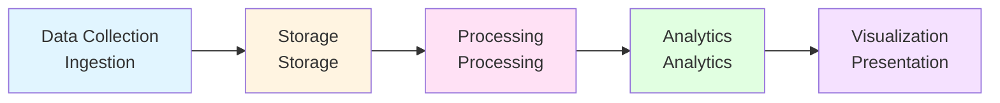
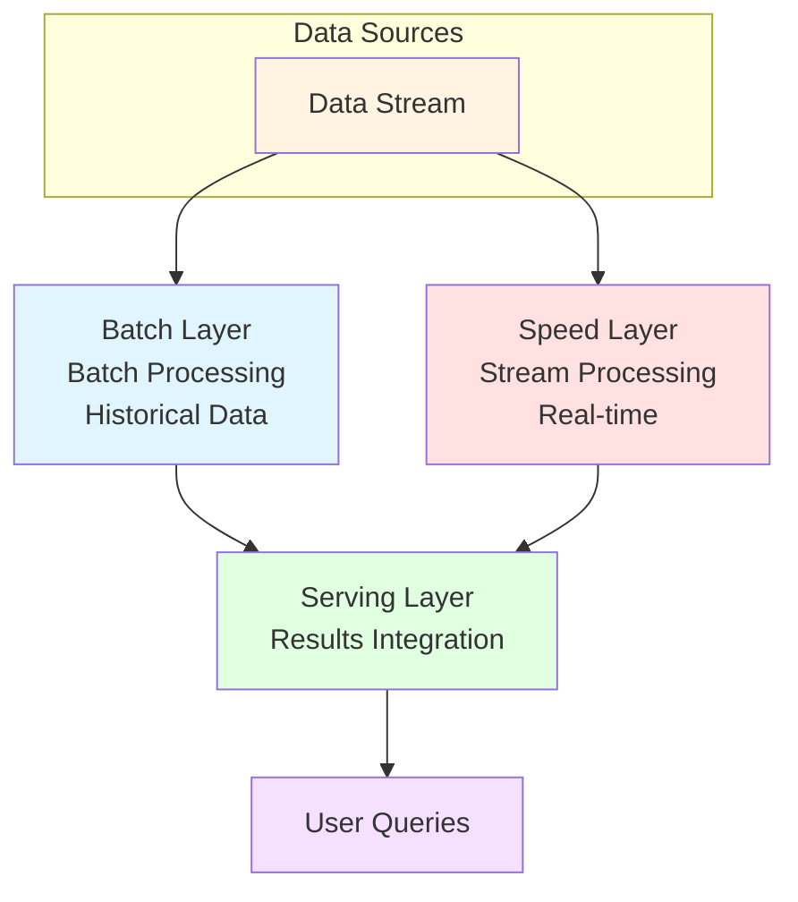
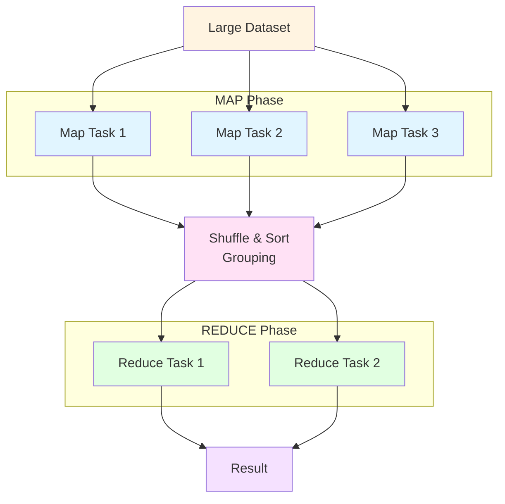
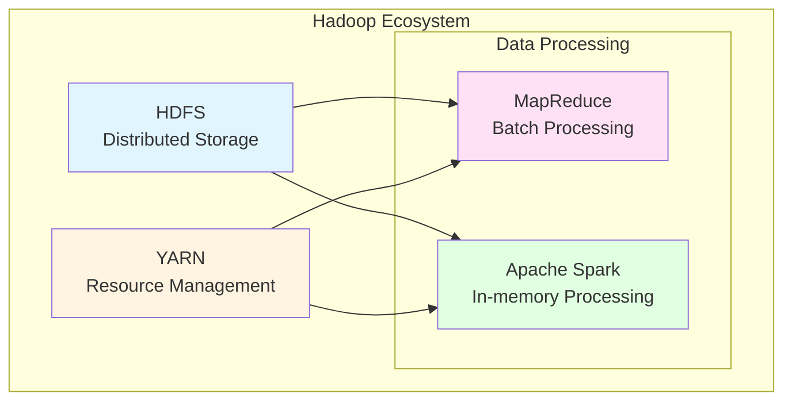
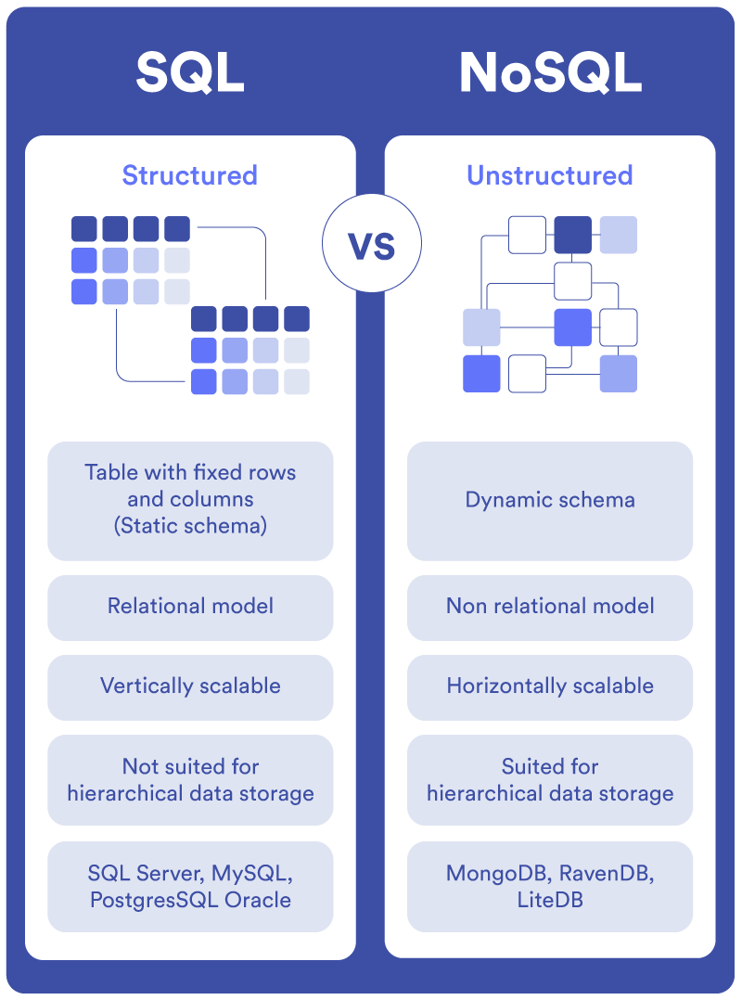
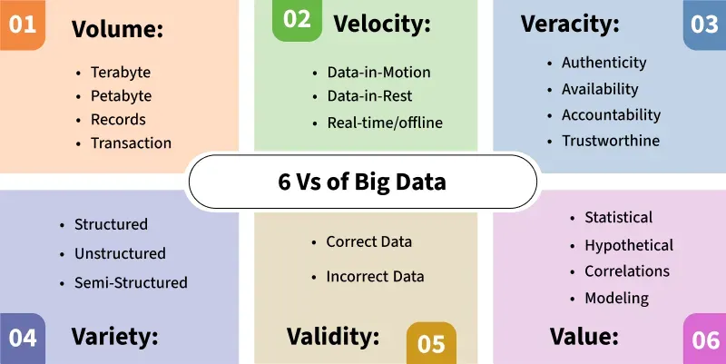

# Lesson 2. Big Data Management Systems

**Discipline:** BIG DATA (Processing of Very Large Data Sets)

**Content Module 1:** Big Data Engineering

**Duration:** 80 minutes (theory ~40 min + practice ~40 min)

---

## Learning Objectives

After completing the lesson, students should be able to:

- understand the main approaches to managing and processing big data;
- know the architecture of big data processing systems (batch and stream processing);
- distinguish between structured, semi-structured, and unstructured data using real examples;
- navigate the Kaggle platform and work with open datasets;
- independently download, explore, and visualize a real dataset (COVID-19).

---

# PART I — THEORETICAL

---

## 1. Big Data Management (15 min)

### 1.1. Storage and Processing Challenges

Traditional relational DBMS (MySQL, PostgreSQL, Oracle) were designed to work with structured data of limited volume on a single server. When data volume exceeds the capacity of a single server, and data arrives in various formats at different speeds — specialized systems are needed.

Main challenge: how to store, process, and analyze petabytes of data arriving in real-time from thousands of sources?

### 1.2. SQL vs NoSQL

**SQL (relational databases):**
- Fixed schema, tables with rows and columns
- ACID guarantees (atomicity, consistency, isolation, durability)
- Well suited for structured data with clear relationships
- Examples: PostgreSQL, MySQL, Oracle

**NoSQL (non-relational databases):**
- Flexible schema or no schema
- Horizontal scaling across server clusters
- Suited for large volumes of heterogeneous data
- Types: document (MongoDB), columnar (Cassandra, HBase), graph (Neo4j), key-value (Redis)

In practice, Big Data systems often combine both approaches depending on the task.

<!--
📷 IMAGE PLACEHOLDER: SQL vs NoSQL Comparison
Google Search: "SQL vs NoSQL comparison diagram infographic"
Alternative: "SQL NoSQL database comparison chart"
Suggested: comparison table or infographic with characteristics comparison
-->

### 1.3. Big Data Processing System Architecture

General data pipeline:



**Batch Processing:**
- Processing large volumes of accumulated data over a defined period
- High throughput, but with latency
- Tools: Apache Hadoop MapReduce, Apache Spark
- Example: daily COVID-19 morbidity report for all countries

**Stream Processing:**
- Real-time data processing as it arrives
- Minimal latency, smaller data portions
- Tools: Apache Kafka, Apache Flink, Apache Storm
- Example: real-time patient temperature monitoring via IoT sensors

**Lambda Architecture** combines both approaches:
- Batch layer — complete processing of all historical data
- Speed layer — real-time processing of new data
- Serving layer — combining results for the user



### 1.4. Hadoop Ecosystem (Overview)

Hadoop is a framework for distributed storage and processing of big data:

- **HDFS** (Hadoop Distributed File System) — distributed file storage on a cluster
- **YARN** — cluster resource management
- **MapReduce** — parallel computation model (Map: split task → Reduce: combine results)
- **Apache Spark** — faster alternative to MapReduce, works in memory

**MapReduce Operating Principle:**





---

## 2. Open Data, Structured and Unstructured Data (10 min)

### 2.1. Open Data

The Open Knowledge Foundation defines open data as "any content, information or data that people can use and redistribute without any legal, technological or social restrictions".

Main open data portals:
- **data.gov.ua** — Ukraine open data portal
- **Kaggle Datasets** — thousands of datasets for research
- **data.gov** (USA), **EU Open Data Portal** (EU)
- **WHO, World Bank, Our World in Data** — international sources

Example: COVID-19 data on Kaggle is open data collected from official sources of 200+ countries and freely available to everyone.

### 2.2. Data Classification by Structure

**Structured Data:**
- Have a clear schema (tables, rows, columns)
- Stored in relational databases, CSV, Excel
- COVID-19 example: date, number of cases, number of vaccinations — numeric fields with fixed format

**Semi-Structured Data:**
- Have some organization but without a rigid schema
- Formats: JSON, XML, server logs
- Example: API responses from disease monitoring services

**Unstructured Data:**
- Have no predefined model
- Text, images, video, audio, social media posts
- Estimated at 70-90% of all global data
- Example: scientific articles about COVID-19 (CORD-19 dataset — 500,000+ articles)

**Data Types - Structured / Unstructured**


---

## 3. Kaggle Platform (15 min)

### 3.1. What is Kaggle

Kaggle is the world's largest platform for Data Science and machine learning, owned by Google. The community has over 15 million users.


### 3.2. Main Features

**Datasets** — open datasets on any topic. Each dataset has a description, preview, discussions, and ready-made Notebooks from the community.

**Notebooks** — cloud environment for writing and running Python/R code directly in the browser. Free access to GPU/TPU for computations. No need to install anything on your computer.

**Competitions** — data analysis competitions where participants compete to build the most accurate models. There are educational competitions (Getting Started) for beginners.

**Courses** — free micro-courses: Python, Pandas, Machine Learning, SQL, Data Visualization, and others. Each course takes several hours and includes practical exercises.

**Models** — repository of pre-trained machine learning models.

**Discussions** — forum for exchanging approaches, questions, and solutions.

### 3.3. Why Kaggle is Suitable for Our Course

- No need to install Python, Jupyter, or libraries — everything works in the browser
- Access to real large datasets
- Ability to see how other researchers approach the same data
- Direct connection between theory (6V, structure) and practice

---

# PART II — PRACTICAL

## Exploring COVID-19 Data on Kaggle

**Goal:** demonstrate the concept of big data, its characteristics (6V), data types, and basic analysis using a real dataset.

**Dataset:** Our World in Data — COVID-19 Dataset
**Link:** https://www.kaggle.com/datasets/owid/covid-19-data

---

### Step 1. Environment Setup (5 min)

1. Open kaggle.com and log into your account
2. Navigate to the COVID-19 dataset (Our World in Data)
3. Click **"New Notebook"** — a cloud environment with Python will open
4. The dataset will automatically connect to the Notebook

> **Instructor Note:** if students are not yet registered — allocate an additional 5 minutes for registration. The process can be shown on a projector.

---

### Step 2. Loading and Initial Overview (10 min)

```python
import pandas as pd
import matplotlib.pyplot as plt

# Load data
df = pd.read_csv('/kaggle/input/covid-19-data/owid-covid-data.csv')

# Dataset size — Volume demonstration
print(f"Number of rows: {df.shape[0]:,}")
print(f"Number of columns: {df.shape[1]}")
print(f"Memory usage: {df.memory_usage(deep=True).sum() / 1024**2:.1f} MB")
```

```python
# List of all columns — Variety demonstration
print(df.columns.tolist())
```

```python
# First 5 rows
df.head()
```

```python
# Data types in the dataset — structured data
print(df.dtypes.value_counts())
```

**Discussion Questions:**
- How many rows and columns are in the dataset? Is this "big data" yet?
- What data types are present (numeric, text, dates)?
- Is this dataset structured? Why?

---

### Step 3. Filtering — Ukraine and Comparison with Other Countries (10 min)

```python
# Filter data for Ukraine
ukraine = df[df['location'] == 'Ukraine'].copy()
print(f"Records for Ukraine: {ukraine.shape[0]}")
print(f"Period: {ukraine['date'].min()} — {ukraine['date'].max()}")
```

```python
# Convert date
ukraine['date'] = pd.to_datetime(ukraine['date'])

# Basic statistics
print(ukraine[['total_cases', 'total_deaths', 'total_vaccinations']].describe())
```

```python
# Compare several countries
countries = ['Ukraine', 'Poland', 'Germany', 'United States']
comparison = df[df['location'].isin(countries)].copy()
comparison['date'] = pd.to_datetime(comparison['date'])
```

**Discussion Questions:**
- Are all dates filled? Are there gaps?
- How complete is the vaccination data?
- Which of the 6V does this illustrate? (Veracity — reliability)

---

### Step 4. Missing Values Analysis — Veracity in Action (5 min)

```python
# Percentage of missing values for key columns
key_columns = ['total_cases', 'new_cases', 'total_deaths',
               'new_deaths', 'total_vaccinations', 'people_vaccinated',
               'icu_patients', 'hosp_patients']

missing = ukraine[key_columns].isnull().mean() * 100
print("Percentage of missing values (%):")
print(missing.round(1).to_string())
```

**Conclusion for Students:** real data always has gaps. This is a Veracity (reliability) problem. Data needs to be cleaned before analysis.

---

### Step 5. Visualization — COVID-19 Dynamics (10 min)

#### Chart 1: New Cases in Ukraine

```python
plt.figure(figsize=(14, 5))
plt.plot(ukraine['date'], ukraine['new_cases_smoothed'],
         color='steelblue', linewidth=1.5)
plt.title('COVID-19: New Cases in Ukraine (smoothed)', fontsize=14)
plt.xlabel('Date')
plt.ylabel('New cases per day')
plt.grid(True, alpha=0.3)
plt.tight_layout()
plt.show()
```

**Question:** where are the peaks visible? How is this related to Variability (data flow variability)?

#### Chart 2: Country Comparison by Total Cases

```python
plt.figure(figsize=(14, 5))
for country in countries:
    data = comparison[comparison['location'] == country]
    plt.plot(data['date'], data['total_cases_per_million'],
             label=country, linewidth=1.5)

plt.title('COVID-19: Total Cases per 1 Million Population', fontsize=14)
plt.xlabel('Date')
plt.ylabel('Cases per 1M')
plt.legend()
plt.grid(True, alpha=0.3)
plt.tight_layout()
plt.show()
```

#### Chart 3: Vaccination Progress

```python
plt.figure(figsize=(14, 5))
for country in countries:
    data = comparison[comparison['location'] == country]
    plt.plot(data['date'], data['people_vaccinated_per_hundred'],
             label=country, linewidth=1.5)

plt.title('COVID-19: Percentage of Vaccinated Population', fontsize=14)
plt.xlabel('Date')
plt.ylabel('Vaccinated per 100 people')
plt.legend()
plt.grid(True, alpha=0.3)
plt.tight_layout()
plt.show()
```

---

### Step 6. Summary and Connection to Theory (5 min)



Students fill in a summary table based on the work completed:

| Characteristic (6V)  | How it manifests in COVID-19 data                                  |
|-----------------------|-------------------------------------------------------------------|
| **Volume**            | Hundreds of thousands of rows, 60+ columns, data from 200+ countries               |
| **Velocity**          | Data updated daily from around the world                             |
| **Variety**           | Numeric, text, dates; structured fields                       |
| **Veracity**          | Missing values, varying reporting quality between countries           |
| **Value**             | Analysis helps make decisions about quarantine and vaccination    |
| **Variability**       | Sharp peaks during pandemic waves, seasonal fluctuations              |

**Data Type:** structured (CSV table with fixed schema)
**Source:** open data (Open Data) — freely available through Kaggle and Our World in Data

---

## Independent Work

**Topic:** Purpose of the Kaggle platform. Definition of big data and examples of big data in the real world.

### Tasks:

1. **Kaggle Notebook** (required):
   - Repeat the practical work from the lesson (COVID-19)
   - Add analysis of one more country of your choice
   - Build an additional chart (e.g., mortality, number of tests, or ICU patients)

2. **Written Report** (1–2 pages):
   - Provide a definition of big data (with reference to NIST or IDC)
   - Give 3–5 examples of big data in the real world from different industries
   - Describe what 6V characteristics you observed in COVID-19 data
   - Specify the data type (structured/semi-structured/unstructured) and justify

3. **Additional** (optional, +2 points):
   - Find another dataset on Kaggle (not COVID-19)
   - Describe it: name, volume, type, potential application
   - Create a Notebook with a basic overview (shape, dtypes, head, describe)

### Grading Criteria:

| Component                          | Points |
|------------------------------------|------|
| Kaggle Notebook completed and works   | 2    |
| Big Data definition and examples     | 1    |
| 6V analysis using COVID-19 example     | 1    |
| Additional chart or analysis        | 1    |
| **Total**                          | **5** |

---

## Recommended Resources

- Lesson 1.1 Materials (Big Data)
- Our World in Data — COVID-19: https://ourworldindata.org/covid-deaths
- Kaggle COVID-19 Dataset: https://www.kaggle.com/datasets/owid/covid-19-data
- Kaggle course "Pandas": https://www.kaggle.com/learn/pandas
- Kaggle course "Data Visualization": https://www.kaggle.com/learn/data-visualization
- NIST Big Data Interoperability Framework: https://bigdatawg.nist.gov/