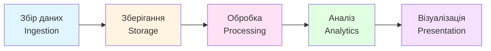
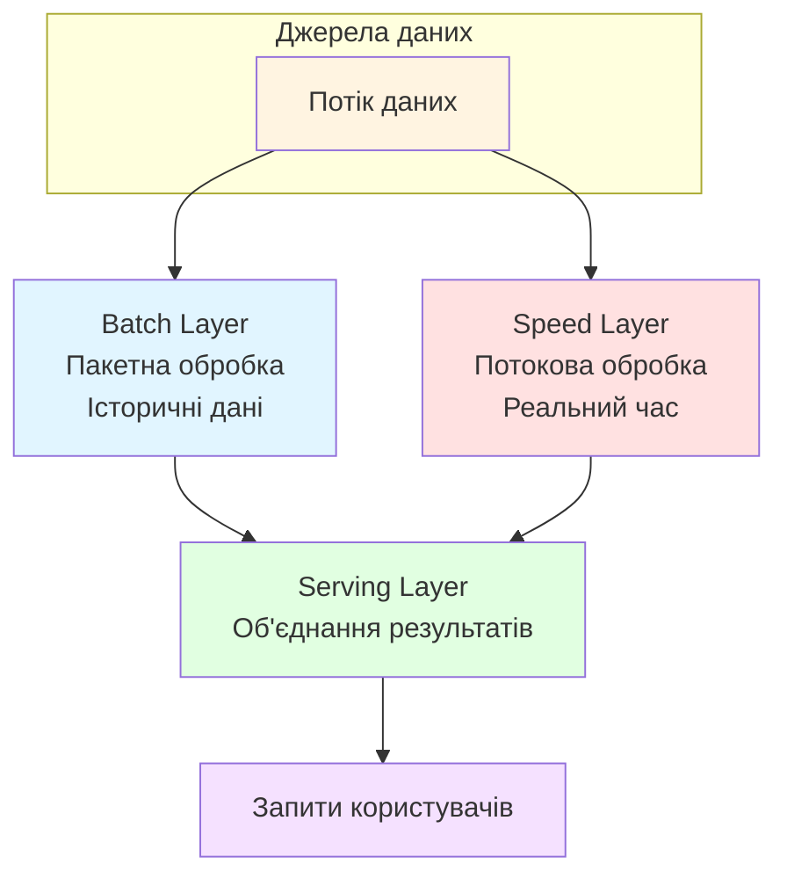
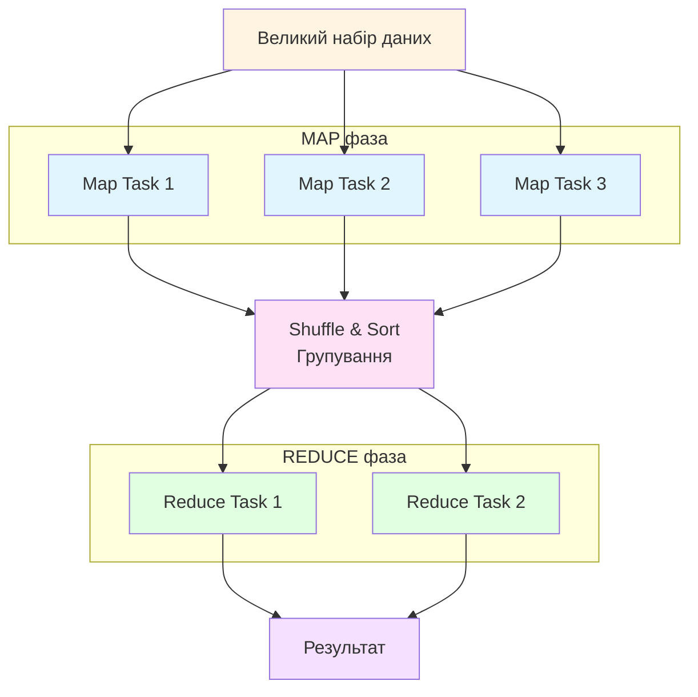
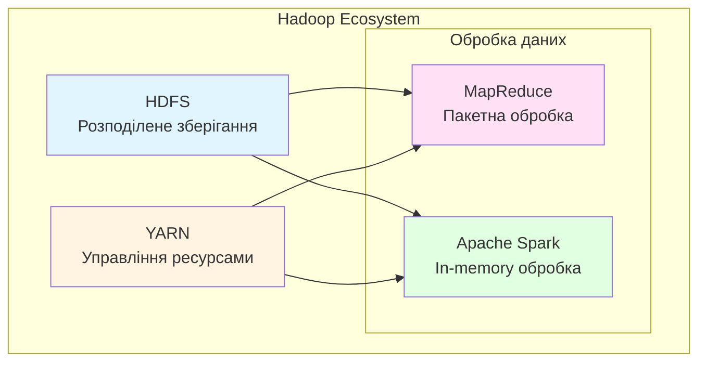

# Заняття 2. Системи управління великими даними

**Дисципліна:** BIG DATA (Обробка надвеликих масивів даних)  
**Змістовий модуль 1:** Інженерія великих наборів даних  
**Тривалість:** 80 хвилин (теорія ~40 хв + практика ~40 хв)

---

## Навчальні цілі

Після завершення заняття здобувачі повинні:

- розуміти основні підходи до управління та обробки великих даних;
- знати архітектуру системи обробки великих даних (пакетна та потокова обробка);
- вміти відрізняти структуровані, напівструктуровані та неструктуровані дані на реальних прикладах;
- орієнтуватися в платформі Kaggle та вміти працювати з відкритими наборами даних;
- самостійно завантажити, дослідити та візуалізувати реальний набір даних (COVID-19).

---

# ЧАСТИНА І — ТЕОРЕТИЧНА

---

## 1. Управління великими даними (15 хв)

### 1.1. Проблема зберігання та обробки

Традиційні реляційні СУБД (MySQL, PostgreSQL, Oracle) проєктувались для роботи з структурованими даними обмеженого обсягу на одному сервері. Коли обсяг даних перевищує можливості одного сервера, а дані надходять у різних форматах із різною швидкістю — потрібні спеціалізовані системи.

Основна проблема: як зберігати, обробляти та аналізувати петабайти даних, що надходять у реальному часі з тисяч джерел?

### 1.2. SQL vs NoSQL

**SQL (реляційні бази даних):**
- Фіксована схема, таблиці з рядками та колонками
- Гарантії ACID (атомарність, узгодженість, ізольованість, довговічність)
- Добре підходять для структурованих даних з чіткими зв'язками
- Приклади: PostgreSQL, MySQL, Oracle

**NoSQL (нереляційні бази даних):**
- Гнучка схема або її відсутність
- Горизонтальне масштабування на кластери серверів
- Підходять для великих обсягів різнорідних даних
- Типи: документні (MongoDB), колонкові (Cassandra, HBase), графові (Neo4j), ключ-значення (Redis)

На практиці системи Big Data часто поєднують обидва підходи залежно від задачі.

<!--
📷 IMAGE PLACEHOLDER: SQL vs NoSQL Comparison
Google Search: "SQL vs NoSQL comparison diagram infographic"
Alternative: "SQL NoSQL database comparison chart"
Suggested: порівняльна таблиця або інфографіка з порівнянням характеристик
-->

### 1.3. Архітектура системи обробки великих даних

Загальний конвеєр обробки (data pipeline):



**Пакетна обробка (Batch Processing):**
- Обробка великих обсягів накопичених даних за визначений період
- Висока пропускна здатність, але з затримкою
- Інструменти: Apache Hadoop MapReduce, Apache Spark
- Приклад: щоденний звіт по захворюваності COVID-19 по всіх країнах

**Потокова обробка (Stream Processing):**
- Обробка даних у реальному часі, по мірі їх надходження
- Мінімальна затримка, менші порції даних
- Інструменти: Apache Kafka, Apache Flink, Apache Storm
- Приклад: моніторинг температури пацієнтів у реальному часі через IoT-датчики

**Lambda-архітектура** поєднує обидва підходи:
- Batch layer — повна обробка всіх історичних даних
- Speed layer — обробка нових даних у реальному часі
- Serving layer — об'єднання результатів для користувача



### 1.4. Екосистема Hadoop (огляд)

Hadoop — це фреймворк для розподіленого зберігання та обробки великих даних:

- **HDFS** (Hadoop Distributed File System) — розподілене зберігання файлів на кластері
- **YARN** — управління ресурсами кластера
- **MapReduce** — модель паралельних обчислень (Map: розділити задачу → Reduce: об'єднати результати)
- **Apache Spark** — швидша альтернатива MapReduce, працює в оперативній пам'яті

**Принцип роботи MapReduce:**





---

## 2. Відкриті дані, структуровані та неструктуровані дані (10 хв)

### 2.1. Відкриті дані (Open Data)

Фонд Open Knowledge Foundation визначає відкриті дані як «будь-який вміст, інформацію або дані, які люди можуть використовувати і перерозподіляти без будь-яких юридичних, технологічних чи соціальних обмежень».

Основні портали відкритих даних:
- **data.gov.ua** — портал відкритих даних України
- **Kaggle Datasets** — тисячі наборів даних для дослідження
- **data.gov** (США), **EU Open Data Portal** (ЄС)
- **WHO, World Bank, Our World in Data** — міжнародні джерела

Приклад: дані COVID-19 на Kaggle — це відкриті дані, зібрані з офіційних джерел 200+ країн і доступні кожному безкоштовно.

### 2.2. Класифікація даних за структурою

**Структуровані дані:**
- Мають чітку схему (таблиці, рядки, колонки)
- Зберігаються у реляційних базах, CSV, Excel
- Приклад у COVID-19: дата, кількість випадків, кількість вакцинацій — числові поля з фіксованим форматом

**Напівструктуровані дані:**
- Мають певну організацію, але без жорсткої схеми
- Формати: JSON, XML, логи серверів
- Приклад: API-відповіді сервісів моніторингу захворюваності

**Неструктуровані дані:**
- Не мають заздалегідь визначеної моделі
- Текст, зображення, відео, аудіо, пости у соціальних мережах
- За оцінками, 70–90% всіх світових даних
- Приклад: наукові статті про COVID-19 (CORD-19 dataset — 500,000+ статей)

**Типи Даних - Структуровані / Неструктуровані**


---

## 3. Платформа Kaggle (15 хв)

### 3.1. Що таке Kaggle

Kaggle — це найбільша у світі платформа для Data Science та машинного навчання, яка належить Google. Спільнота налічує понад 15 мільйонів користувачів.


### 3.2. Основні можливості

**Datasets** — відкриті набори даних на будь-яку тематику. Кожен набір має опис, попередній перегляд, обговорення та готові Notebooks від спільноти.

**Notebooks** — хмарне середовище для написання та запуску коду Python/R прямо у браузері. Надається безкоштовний доступ до GPU/TPU для обчислень. Не потрібно нічого встановлювати на свій комп'ютер.

**Competitions** — змагання з аналізу даних, де учасники змагаються у побудові найточніших моделей. Є навчальні змагання (Getting Started) для початківців.

**Courses** — безкоштовні мікро-курси: Python, Pandas, Machine Learning, SQL, Data Visualization та інші. Кожен курс займає кілька годин і включає практичні завдання.

**Models** — репозиторій попередньо навчених моделей машинного навчання.

**Discussions** — форум для обміну підходами, питаннями та рішеннями.

### 3.3. Чому Kaggle підходить для нашого курсу

- Не потрібно встановлювати Python, Jupyter або бібліотеки — все працює у браузері
- Доступ до реальних великих наборів даних
- Можна побачити, як інші дослідники підходять до тих самих даних
- Прямий зв'язок між теорією (6V, структурованість) і практикою

---

# ЧАСТИНА ІІ — ПРАКТИЧНА

## Дослідження даних COVID-19 на Kaggle

**Мета:** на реальному наборі даних продемонструвати поняття великих даних, їх характеристики (6V), типи даних та базовий аналіз.

**Набір даних:** Our World in Data — COVID-19 Dataset  
**Посилання:** https://www.kaggle.com/datasets/owid/covid-19-data  

---

### Крок 1. Підготовка середовища (5 хв)

1. Відкрити kaggle.com та увійти до облікового запису
2. Перейти до набору даних COVID-19 (Our World in Data)
3. Натиснути **"New Notebook"** — відкриється хмарне середовище з Python
4. Набір даних автоматично підключиться до Notebook

> **Примітка для викладача:** якщо студенти ще не зареєстровані — виділити додаткові 5 хвилин на реєстрацію. Можна показати процес на проєкторі.

---

### Крок 2. Завантаження та перший огляд (10 хв)

```python
import pandas as pd
import matplotlib.pyplot as plt

# Завантаження даних
df = pd.read_csv('/kaggle/input/covid-19-data/owid-covid-data.csv')

# Розмір набору даних — демонстрація Volume
print(f"Кількість рядків: {df.shape[0]:,}")
print(f"Кількість колонок: {df.shape[1]}")
print(f"Обсяг пам'яті: {df.memory_usage(deep=True).sum() / 1024**2:.1f} МБ")
```

```python
# Список усіх колонок — демонстрація Variety
print(df.columns.tolist())
```

```python
# Перші 5 рядків
df.head()
```

```python
# Типи даних у наборі — структуровані дані
print(df.dtypes.value_counts())
```

**Питання для обговорення:**
- Скільки рядків і колонок у наборі? Чи це вже "великі дані"?
- Які типи даних присутні (числові, текстові, дати)?
- Чи є цей набір структурованим? Чому?

---

### Крок 3. Фільтрація — Україна та порівняння з іншими країнами (10 хв)

```python
# Фільтруємо дані для України
ukraine = df[df['location'] == 'Ukraine'].copy()
print(f"Записів по Україні: {ukraine.shape[0]}")
print(f"Період: {ukraine['date'].min()} — {ukraine['date'].max()}")
```

```python
# Конвертуємо дату
ukraine['date'] = pd.to_datetime(ukraine['date'])

# Основна статистика
print(ukraine[['total_cases', 'total_deaths', 'total_vaccinations']].describe())
```

```python
# Порівняння декількох країн
countries = ['Ukraine', 'Poland', 'Germany', 'United States']
comparison = df[df['location'].isin(countries)].copy()
comparison['date'] = pd.to_datetime(comparison['date'])
```

**Питання для обговорення:**
- Чи всі дати заповнені? Є пропуски?
- Наскільки повні дані по вакцинації?
- Це ілюстрація якого з 6V? (Veracity — достовірність)

---

### Крок 4. Аналіз пропущених значень — Veracity у дії (5 хв)

```python
# Відсоток пропущених значень по ключових колонках
key_columns = ['total_cases', 'new_cases', 'total_deaths', 
               'new_deaths', 'total_vaccinations', 'people_vaccinated',
               'icu_patients', 'hosp_patients']

missing = ukraine[key_columns].isnull().mean() * 100
print("Відсоток пропущених значень (%):")
print(missing.round(1).to_string())
```

**Висновок для студентів:** реальні дані завжди мають пропуски. Це — проблема Veracity (достовірності). Перед аналізом дані потрібно очищувати.

---

### Крок 5. Візуалізація — динаміка COVID-19 (10 хв)

#### Графік 1: Нові випадки в Україні

```python
plt.figure(figsize=(14, 5))
plt.plot(ukraine['date'], ukraine['new_cases_smoothed'], 
         color='steelblue', linewidth=1.5)
plt.title('COVID-19: Нові випадки в Україні (згладжені)', fontsize=14)
plt.xlabel('Дата')
plt.ylabel('Нові випадки на день')
plt.grid(True, alpha=0.3)
plt.tight_layout()
plt.show()
```

**Питання:** де видно піки? Як це пов'язано з Variability (мінливість потоку даних)?

#### Графік 2: Порівняння країн за загальною кількістю випадків

```python
plt.figure(figsize=(14, 5))
for country in countries:
    data = comparison[comparison['location'] == country]
    plt.plot(data['date'], data['total_cases_per_million'], 
             label=country, linewidth=1.5)

plt.title('COVID-19: Загальна кількість випадків на 1 млн населення', fontsize=14)
plt.xlabel('Дата')
plt.ylabel('Випадків на 1 млн')
plt.legend()
plt.grid(True, alpha=0.3)
plt.tight_layout()
plt.show()
```

#### Графік 3: Прогрес вакцинації

```python
plt.figure(figsize=(14, 5))
for country in countries:
    data = comparison[comparison['location'] == country]
    plt.plot(data['date'], data['people_vaccinated_per_hundred'], 
             label=country, linewidth=1.5)

plt.title('COVID-19: Відсоток вакцинованого населення', fontsize=14)
plt.xlabel('Дата')
plt.ylabel('Вакциновано на 100 осіб')
plt.legend()
plt.grid(True, alpha=0.3)
plt.tight_layout()
plt.show()
```

---

### Крок 6. Підсумки та зв'язок з теорією (5 хв)


Студенти заповнюють підсумкову таблицю на основі виконаної роботи:

| Характеристика (6V)  | Як проявляється у даних COVID-19                                  |
|-----------------------|-------------------------------------------------------------------|
| **Volume**            | Сотні тисяч рядків, 60+ колонок, дані з 200+ країн               |
| **Velocity**          | Дані оновлюються щодня з усього світу                             |
| **Variety**           | Числові, текстові, дати; структуровані поля                       |
| **Veracity**          | Пропущені значення, різна якість звітності між країнами           |
| **Value**             | Аналіз допомагає приймати рішення щодо карантину та вакцинації    |
| **Variability**       | Різкі піки під час хвиль пандемії, сезонні коливання              |

**Тип даних:** структуровані (таблиця CSV з фіксованою схемою)  
**Джерело:** відкриті дані (Open Data) — доступні безкоштовно через Kaggle та Our World in Data

---

## Самостійна робота

**Тема:** Призначення платформи Kaggle. Визначення великих даних та приклади великих даних у реальному світі.

### Завдання:

1. **Kaggle Notebook** (обов'язково):
   - Повторити практичну роботу з заняття (COVID-19)
   - Додати аналіз ще однієї країни на власний вибір
   - Побудувати додатковий графік (наприклад: смертність, кількість тестів, або ICU-пацієнти)

2. **Письмовий звіт** (1–2 сторінки):
   - Дати визначення великих даних (з посиланням на NIST або IDC)
   - Навести 3–5 прикладів великих даних у реальному світі з різних галузей
   - Описати, які характеристики 6V ви побачили у даних COVID-19
   - Вказати тип даних (структуровані/напівструктуровані/неструктуровані) та обґрунтувати

3. **Додатково** (за бажанням, +2 бали):
   - Знайти на Kaggle інший набір даних (не COVID-19)
   - Описати його: назва, обсяг, тип, потенційне застосування
   - Створити Notebook з базовим оглядом (shape, dtypes, head, describe)

### Критерії оцінювання:

| Компонент                          | Бали |
|------------------------------------|------|
| Kaggle Notebook виконано і працює   | 2    |
| Визначення Big Data та приклади     | 1    |
| Аналіз 6V на прикладі COVID-19     | 1    |
| Додатковий графік або аналіз        | 1    |
| **Разом**                          | **5** |

---

## Рекомендовані ресурси

- Матеріали Заняття 1.1 (Великі дані)
- Our World in Data — COVID-19: https://ourworldindata.org/covid-deaths
- Kaggle COVID-19 Dataset: https://www.kaggle.com/datasets/owid/covid-19-data
- Kaggle курс "Pandas": https://www.kaggle.com/learn/pandas
- Kaggle курс "Data Visualization": https://www.kaggle.com/learn/data-visualization
- NIST Big Data Interoperability Framework: https://bigdatawg.nist.gov/