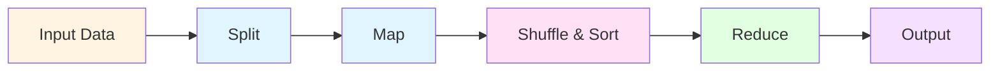
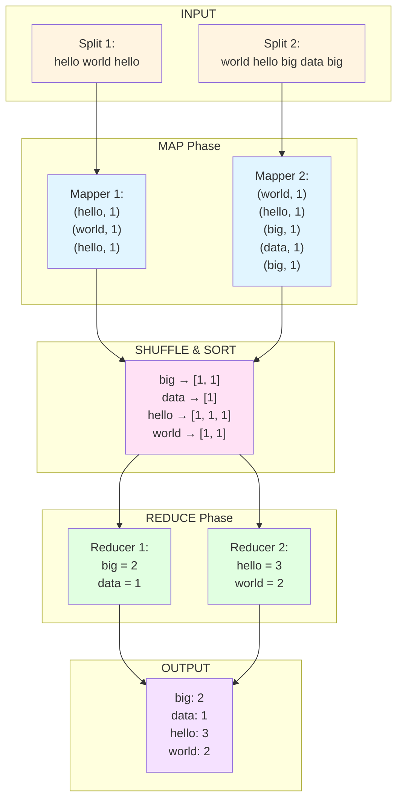
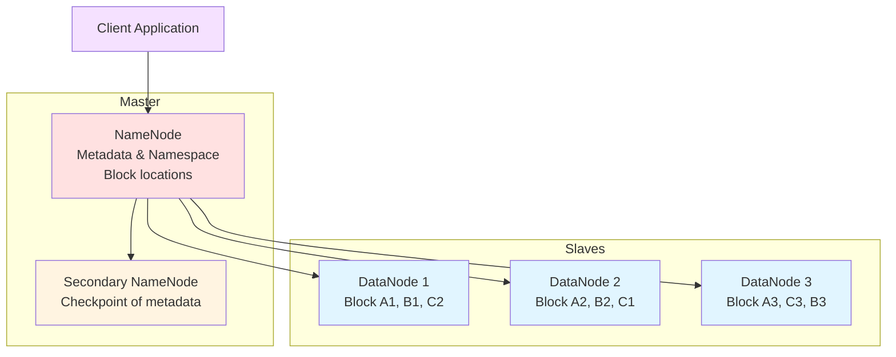
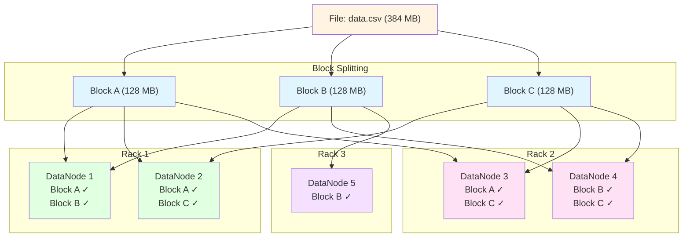
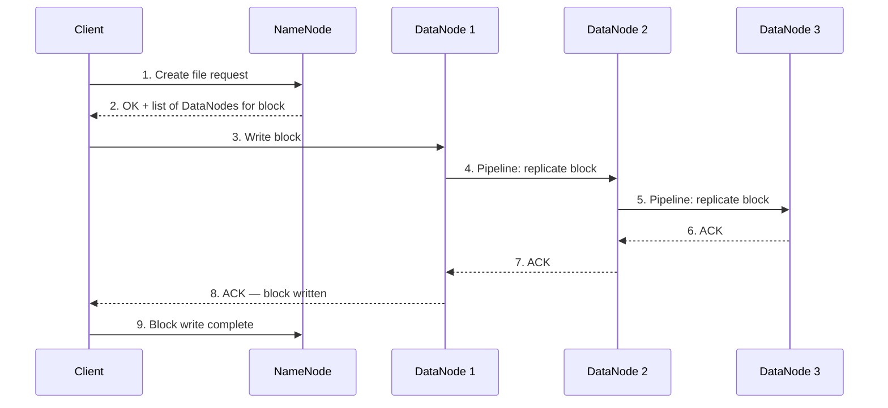
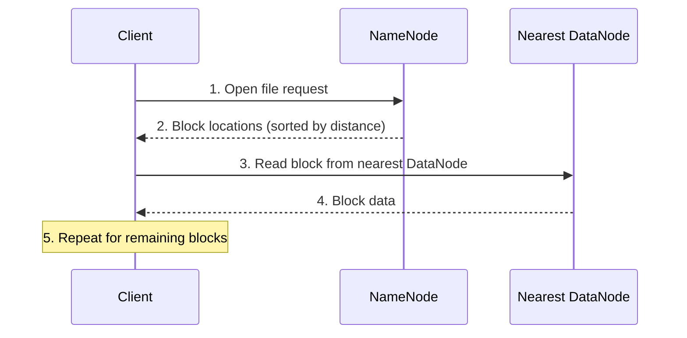

# Lesson 3. Big Data Technologies and Data Asset Management

> View [Ukrainian version](README_ua.md)

**Discipline:** BIG DATA (Processing of Very Large Data Sets)

**Content Module 1:** Big Data Engineering

**Duration:** 80 minutes (theory ~40 min + practice ~40 min)

---

## Learning Objectives

After completing the lesson, students should be able to:

- understand the MapReduce paradigm and its processing stages;
- know the architecture and components of HDFS (Hadoop Distributed File System);
- be able to trace MapReduce execution on a simple example;
- understand data replication and fault tolerance in HDFS.

---

# PART I — THEORETICAL

---

## 1. MapReduce Paradigm (20 min)

### 1.1. Why MapReduce

When a dataset is too large to fit on a single machine, we need a way to split the work across many machines and then combine the results. This is exactly what **MapReduce** does — it is a programming model for processing large datasets in parallel across a cluster of computers.

Key idea: instead of moving data to the program, we move the program to the data. Each node processes only its local portion of data (**data locality**), which dramatically reduces network traffic.

MapReduce was originally developed at Google (2004) for indexing the web and was later implemented as a core component of Apache Hadoop.

### 1.2. Core Stages of MapReduce

The MapReduce pipeline consists of the following stages:



1. **Input** — the source data (e.g., text files in HDFS)
2. **Split** — the input is divided into fixed-size chunks (splits), each assigned to a mapper
3. **Map** — each mapper processes its split and emits intermediate key-value pairs
4. **Shuffle & Sort** — the framework groups all intermediate values by key and sorts them
5. **Reduce** — each reducer aggregates values for a given key and produces the final output
6. **Output** — results are written back to the distributed file system

### 1.3. Word Count — Step-by-Step Example

The classic MapReduce example is **Word Count**: count how many times each word appears in a text.

**Input text (2 lines, split into 2 chunks):**

| Split   | Content                    |
|---------|----------------------------|
| Split 1 | `hello world hello`        |
| Split 2 | `world hello big data big` |

**Step-by-step execution:**




### 1.4. Advantages and Limitations of MapReduce

**Advantages:**
- **Fault tolerance** — if a node fails, the framework re-runs its tasks on another node
- **Scalability** — add more nodes to process more data
- **Data locality** — computation moves to data, minimizing network transfer
- **Simplicity** — developer only writes `map()` and `reduce()` functions

**Limitations:**
- **High latency** — not suited for real-time or low-latency queries; results are available only after all stages complete
- **Not suited for iterative algorithms** — each iteration requires reading from and writing to disk (e.g., machine learning algorithms that need many passes over data)
- **Complex multi-stage jobs** — chaining multiple MapReduce jobs is cumbersome; Spark's DAG model is more flexible
- **Only batch processing** — cannot handle streaming data natively

---

## 2. HDFS — Hadoop Distributed File System (20 min)

### 2.1. Why a Distributed File System

Traditional file systems (ext4, NTFS) are designed for a single machine. When data reaches petabyte scale, no single disk or server can hold it all. We need a file system that:

- spreads data across hundreds or thousands of machines;
- continues working even when some machines fail;
- provides high-throughput access for large sequential reads.

HDFS was designed to solve exactly these problems. It is optimized for large files (GB to TB) with a write-once, read-many-times access pattern.

### 2.2. HDFS Architecture

HDFS follows a **master-slave** architecture with three main components:



**NameNode (Master):**
- Stores the file system namespace (directory tree, file-to-block mapping)
- Knows which DataNodes hold which blocks
- Does NOT store actual data — only metadata
- Single point of coordination (high-availability setups use a standby NameNode)

**DataNode (Slave):**
- Stores actual data blocks on local disks
- Sends periodic heartbeats and block reports to the NameNode
- Performs read/write operations on request from clients

**Secondary NameNode:**
- Periodically merges the NameNode's edit log with its filesystem image (checkpoint)
- Helps reduce NameNode restart time
- Is NOT a failover node for the NameNode

### 2.3. Data Replication and Fault Tolerance

HDFS splits each file into fixed-size **blocks** (default 128 MB) and replicates each block across multiple DataNodes (default **replication factor = 3**).



**Rack awareness:** HDFS places replicas on different racks to survive rack-level failures. Typical placement policy for replication factor 3:
- 1st replica: on a node in the local rack
- 2nd replica: on a node in a different rack
- 3rd replica: on another node in the second rack

**Fault tolerance scenario:** if DataNode 1 goes down, blocks A and B are still available from other DataNodes. The NameNode detects the failure via missing heartbeats and instructs other DataNodes to create new replicas to restore the replication factor.

### 2.4. Read and Write Operations

**Write operation flow:**



Key points:
- Data is written in a **pipeline** — the client sends data to the first DataNode, which forwards it to the second, and so on
- Acknowledgements flow back through the pipeline
- The NameNode is only involved for metadata — actual data never passes through it

**Read operation flow:**



Key points:
- The client reads from the **nearest** DataNode (data locality)
- If a DataNode is unavailable, the client transparently switches to the next replica

---

# PART II — PRACTICAL

---

## Exercise 1: Paper-Based MapReduce Tracing (15 min)

**Goal:** trace a MapReduce Word Count execution by hand to deeply understand each stage.

### Task

Given the following input text, split into 3 chunks:

| Split   | Content                              |
|---------|--------------------------------------|
| Split 1 | `big data is big`                    |
| Split 2 | `data processing is fast`            |
| Split 3 | `big data processing`                |

**On paper (or in a notebook), work through these steps:**

**Step 1 — Map Phase:** For each split, list all (key, value) pairs where key = word and value = 1.

Expected output for Split 1:
```
(big, 1), (data, 1), (is, 1), (big, 1)
```

**Step 2 — Shuffle & Sort:** Group all pairs from all mappers by key, and sort alphabetically.

Expected result:
```
big  → [1, 1, 1]
data → [1, 1, 1]
fast → [1]
is   → [1, 1]
processing → [1, 1]
```

**Step 3 — Reduce Phase:** Sum the values for each key.

Expected result:
```
big: 3, data: 3, fast: 1, is: 2, processing: 2
```

**Group discussion:**
- What happens if one split is much larger than the others?
- What if a mapper fails during processing?
- How would you count word frequency across 1 TB of text?

---

## Exercise 2: Python MapReduce Simulation (20 min)

**Goal:** implement a simple MapReduce Word Count in pure Python to see the paradigm in code.

### Part A: Basic Word Count

```python
from collections import defaultdict

# --- Input Data ---
documents = [
    "big data is big",
    "data processing is fast",
    "big data processing"
]

# --- MAP Phase ---
def map_function(document):
    """Emit (word, 1) for each word in the document."""
    results = []
    for word in document.lower().split():
        results.append((word, 1))
    return results

# Run mappers (one per document)
mapped = []
for doc in documents:
    mapped.extend(map_function(doc))

print("After MAP phase:")
for pair in mapped:
    print(f"  {pair}")
```

```python
# --- SHUFFLE & SORT Phase ---
def shuffle_and_sort(mapped_pairs):
    """Group values by key."""
    groups = defaultdict(list)
    for key, value in mapped_pairs:
        groups[key].append(value)
    return dict(sorted(groups.items()))

shuffled = shuffle_and_sort(mapped)

print("\nAfter SHUFFLE & SORT phase:")
for key, values in shuffled.items():
    print(f"  {key} → {values}")
```

```python
# --- REDUCE Phase ---
def reduce_function(key, values):
    """Sum all values for the key."""
    return (key, sum(values))

# Run reducers (one per key)
results = []
for key, values in shuffled.items():
    results.append(reduce_function(key, values))

print("\nAfter REDUCE phase (final result):")
for key, count in results:
    print(f"  {key}: {count}")
```

**Expected output:**
```
After REDUCE phase (final result):
  big: 3
  data: 3
  fast: 1
  is: 2
  processing: 2
```

### Part B: Character Frequency Count

Now adapt the MapReduce pattern for a different task — counting character frequency:

```python
# --- MAP: emit (character, 1) for each letter ---
def map_chars(document):
    results = []
    for char in document.lower():
        if char.isalpha():  # skip spaces and punctuation
            results.append((char, 1))
    return results

# --- Run the full MapReduce pipeline ---
mapped_chars = []
for doc in documents:
    mapped_chars.extend(map_chars(doc))

shuffled_chars = shuffle_and_sort(mapped_chars)
char_results = [reduce_function(k, v) for k, v in shuffled_chars.items()]

print("Character frequency:")
for char, count in sorted(char_results, key=lambda x: -x[1]):
    print(f"  '{char}': {count}")
```

### Part C (bonus): Average Word Length

```python
# --- MAP: emit (first_letter, word_length) ---
def map_avg_length(document):
    results = []
    for word in document.lower().split():
        results.append((word[0], len(word)))
    return results

# --- REDUCE: compute average instead of sum ---
def reduce_average(key, values):
    return (key, round(sum(values) / len(values), 1))

mapped_avg = []
for doc in documents:
    mapped_avg.extend(map_avg_length(doc))

shuffled_avg = shuffle_and_sort(mapped_avg)
avg_results = [reduce_average(k, v) for k, v in shuffled_avg.items()]

print("Average word length by first letter:")
for letter, avg in sorted(avg_results):
    print(f"  '{letter}': {avg}")
```

**Discussion:** notice how only the `map()` and `reduce()` functions change while the overall pipeline (map → shuffle → reduce) stays the same. This is the power of the MapReduce abstraction.

---

## Exercise 3: HDFS Block Placement Discussion (5 min)

**Scenario:** you have a file `logs.txt` (384 MB) and an HDFS cluster with block size = 128 MB and replication factor = 3. The cluster has 2 racks with 3 DataNodes each.

**Questions for group discussion:**

1. How many blocks will the file be split into?
2. How many total block replicas will be stored across the cluster?
3. Draw a diagram showing one possible block placement across the 6 DataNodes (respecting rack awareness).
4. If Rack 1 loses power completely, will the file still be fully readable? Why?
5. What happens to the replication factor after a DataNode failure? How does HDFS restore it?

---

## Independent Work

**Topic:** MapReduce paradigm and HDFS architecture.

### Tasks:

1. **Written Report** (1–2 pages):
   - Define the MapReduce paradigm and describe each stage (Input, Split, Map, Shuffle & Sort, Reduce, Output)
   - Provide a Word Count example with a different input text (not from the lesson)
   - List 2 advantages and 2 limitations of MapReduce

2. **HDFS Architecture Diagram**:
   - Draw a diagram of the HDFS architecture showing NameNode, Secondary NameNode, and at least 4 DataNodes across 2 racks
   - Show block placement for a sample file with replication factor 3
   - Add brief explanations for each component

3. **Additional** (optional, +2 points):
   - Implement a MapReduce simulation in Python for a different task (e.g., finding the maximum value per category, counting line lengths, or computing word frequency in a text file)
   - Include map, shuffle, and reduce stages

### Grading Criteria:

| Component                                         | Points |
|---------------------------------------------------|--------|
| MapReduce definition and stages with example       | 2      |
| HDFS architecture diagram with explanations        | 2      |
| Advantages and limitations of MapReduce            | 1      |
| **Total**                                         | **5**  |

---

## Recommended Resources

- [Lesson 2 — Big Data Management Systems](../lesson1-2/README.md)
- Apache Hadoop Documentation: https://hadoop.apache.org/docs/stable/
- HDFS Architecture Guide: https://hadoop.apache.org/docs/stable/hadoop-project-dist/hadoop-hdfs/HdfsDesign.html
- MapReduce Tutorial: https://hadoop.apache.org/docs/stable/hadoop-mapreduce-client/hadoop-mapreduce-client-core/MapReduceTutorial.html
- Jeffrey Dean & Sanjay Ghemawat, "MapReduce: Simplified Data Processing on Large Clusters" (2004): https://research.google/pubs/pub62/
