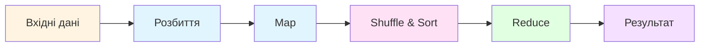
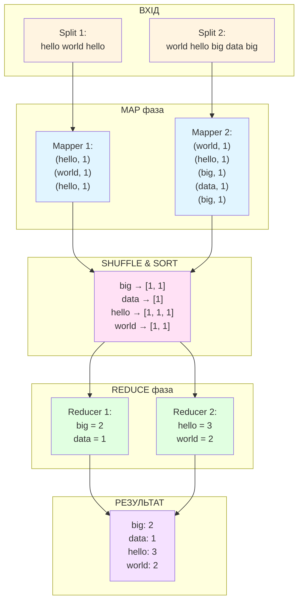
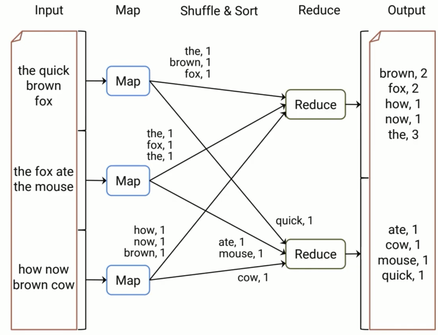
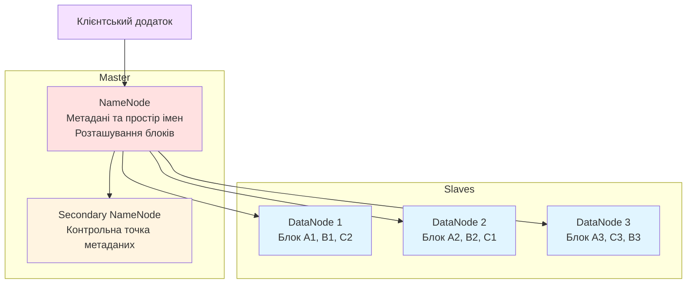
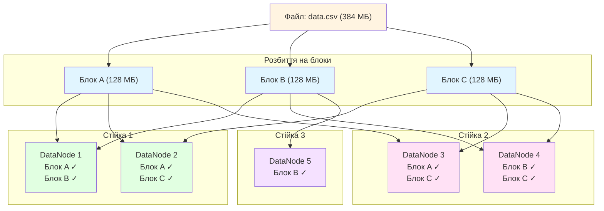
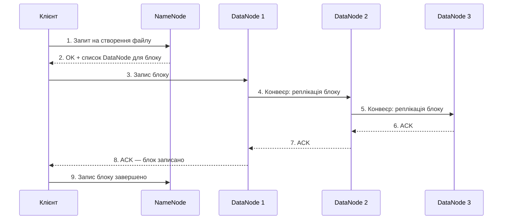
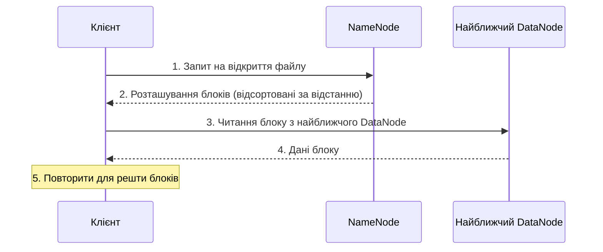

# Заняття 3. Технології Big Data та управління інформаційними активами

> Подивитись [версію англійською](README.md)

**Дисципліна:** BIG DATA (Обробка надвеликих масивів даних)
**Змістовий модуль 1:** Інженерія великих наборів даних
**Тривалість:** 80 хвилин (теорія ~40 хв + практика ~40 хв)

---

## Навчальні цілі

Після завершення заняття здобувачі повинні:

- розуміти парадигму MapReduce та її етапи обробки даних;
- знати архітектуру та компоненти HDFS (Hadoop Distributed File System);
- вміти відстежити виконання MapReduce на простому прикладі;
- розуміти реплікацію даних та відмовостійкість в HDFS.

---

# ЧАСТИНА І — ТЕОРЕТИЧНА

---

## 1. Парадигма MapReduce (20 хв)

### 1.1. Навіщо потрібен MapReduce

Коли набір даних занадто великий, щоб поміститися на одній машині, потрібен спосіб розділити роботу між багатьма машинами, а потім об'єднати результати. Саме це робить **MapReduce** — це модель програмування для паралельної обробки великих наборів даних на кластері комп'ютерів.

Ключова ідея: замість переміщення даних до програми, ми переміщуємо програму до даних. Кожен вузол обробляє лише свою локальну частину даних (**локальність даних**), що суттєво зменшує мережевий трафік.

MapReduce був спочатку розроблений у Google (2004) для індексації вебу і пізніше реалізований як ключовий компонент Apache Hadoop.

### 1.2. Основні етапи MapReduce

Конвеєр MapReduce складається з наступних етапів:



1. **Input (Вхід)** — вихідні дані (наприклад, текстові файли в HDFS)
2. **Split (Розбиття)** — вхідні дані розділяються на частини фіксованого розміру, кожна призначається мапперу
3. **Map (Відображення)** — кожен маппер обробляє свою частину та створює проміжні пари ключ-значення
4. **Shuffle & Sort (Перемішування та сортування)** — фреймворк групує всі проміжні значення за ключем та сортує їх
5. **Reduce (Зведення)** — кожен редюсер агрегує значення для заданого ключа та формує кінцевий результат
6. **Output (Вихід)** — результати записуються назад у розподілену файлову систему

### 1.3. Word Count — покроковий приклад

Класичний приклад MapReduce — **Word Count**: підрахунок кількості входжень кожного слова в тексті.

**Вхідний текст (2 рядки, розбиті на 2 частини):**

| Частина  | Зміст                      |
|----------|-----------------------------|
| Split 1  | `hello world hello`         |
| Split 2  | `world hello big data big`  |

**Покрокове виконання:**





### 1.4. Переваги та обмеження MapReduce

**Переваги:**
- **Відмовостійкість** — якщо вузол виходить з ладу, фреймворк перезапускає його задачі на іншому вузлі
- **Масштабованість** — додайте більше вузлів для обробки більшого обсягу даних
- **Локальність даних** — обчислення переміщуються до даних, мінімізуючи мережеву передачу
- **Простота** — розробник пише лише функції `map()` та `reduce()`

**Обмеження:**
- **Висока затримка** — не підходить для запитів у реальному часі; результати доступні лише після завершення всіх етапів
- **Не підходить для ітеративних алгоритмів** — кожна ітерація вимагає читання та запису на диск (наприклад, алгоритми машинного навчання, що потребують багатьох проходів по даних)
- **Складні багатоетапні завдання** — ланцюжок кількох MapReduce-завдань є громіздким; DAG-модель Spark є гнучкішою
- **Лише пакетна обробка** — не може обробляти потокові дані

---

## 2. HDFS — Hadoop Distributed File System (20 хв)

### 2.1. Навіщо потрібна розподілена файлова система

Традиційні файлові системи (ext4, NTFS) розраховані на один комп'ютер. Коли дані сягають петабайтного масштабу, жоден окремий диск чи сервер не може їх вмістити. Потрібна файлова система, яка:

- розподіляє дані серед сотень або тисяч машин;
- продовжує працювати навіть при виході з ладу деяких машин;
- забезпечує високопропускний доступ для великих послідовних читань.

HDFS було створено саме для вирішення цих проблем. Система оптимізована для великих файлів (від ГБ до ТБ) з моделлю доступу «записати один раз — читати багато разів».

### 2.2. Архітектура HDFS

HDFS побудована за архітектурою **master-slave** з трьома основними компонентами:



**NameNode (Master):**
- Зберігає простір імен файлової системи (дерево каталогів, відображення файлів на блоки)
- Знає, які DataNode зберігають які блоки
- НЕ зберігає фактичні дані — лише метадані
- Єдина точка координації (конфігурації високої доступності використовують резервний NameNode)

**DataNode (Slave):**
- Зберігає фактичні блоки даних на локальних дисках
- Періодично надсилає heartbeat-повідомлення та звіти про блоки до NameNode
- Виконує операції читання/запису за запитом від клієнтів

**Secondary NameNode:**
- Періодично об'єднує журнал редагування NameNode з образом файлової системи (контрольна точка)
- Допомагає зменшити час перезапуску NameNode
- НЕ є резервним вузлом для NameNode

### 2.3. Реплікація даних та відмовостійкість

HDFS розбиває кожен файл на **блоки** фіксованого розміру (за замовчуванням 128 МБ) і реплікує кожен блок на кілька DataNode (за замовчуванням **фактор реплікації = 3**).



**Rack awareness (обізнаність про стійки):** HDFS розміщує репліки на різних стійках для витримки відмов на рівні стійки. Типова політика розміщення для фактора реплікації 3:
- 1-а репліка: на вузлі в локальній стійці
- 2-а репліка: на вузлі в іншій стійці
- 3-а репліка: на іншому вузлі в другій стійці

**Сценарій відмовостійкості:** якщо DataNode 1 виходить з ладу, блоки A і B все ще доступні з інших DataNode. NameNode виявляє збій через відсутні heartbeat-повідомлення та інструктує інші DataNode створити нові репліки для відновлення фактора реплікації.

### 2.4. Операції читання та запису

**Процес операції запису:**



Ключові моменти:
- Дані записуються **конвеєром** — клієнт надсилає дані першому DataNode, який передає їх другому, і так далі
- Підтвердження повертаються через конвеєр у зворотному напрямку
- NameNode бере участь лише для метаданих — фактичні дані ніколи не проходять через нього

**Процес операції читання:**



Ключові моменти:
- Клієнт читає з **найближчого** DataNode (локальність даних)
- Якщо DataNode недоступний, клієнт прозоро перемикається на наступну репліку

---

# ЧАСТИНА ІІ — ПРАКТИЧНА

---

## Вправа 1: MapReduce на папері (15 хв)

**Мета:** відстежити виконання MapReduce Word Count вручну, щоб глибоко зрозуміти кожен етап.

### Завдання

Вхідний текст, розбитий на 3 частини:

| Частина  | Зміст                                |
|----------|--------------------------------------|
| Split 1  | `big data is big`                    |
| Split 2  | `data processing is fast`            |
| Split 3  | `big data processing`                |

**На папері (або в зошиті) пройдіть наступні кроки:**

**Крок 1 — Map фаза:** Для кожної частини перелічіть усі пари (ключ, значення), де ключ = слово, значення = 1.

Очікуваний результат для Split 1:
```
(big, 1), (data, 1), (is, 1), (big, 1)
```

**Крок 2 — Shuffle & Sort:** Згрупуйте всі пари від усіх маперів за ключем та відсортуйте за алфавітом.

Очікуваний результат:
```
big  → [1, 1, 1]
data → [1, 1, 1]
fast → [1]
is   → [1, 1]
processing → [1, 1]
```

**Крок 3 — Reduce фаза:** Підсумуйте значення для кожного ключа.

Очікуваний результат:
```
big: 3, data: 3, fast: 1, is: 2, processing: 2
```

**Групове обговорення:**
- Що станеться, якщо одна частина значно більша за інші?
- Що буде, якщо маппер вийде з ладу під час обробки?
- Як би ви підрахували частоту слів у 1 ТБ тексту?

---

## Вправа 2: MapReduce симуляція на Python (20 хв)

**Мета:** реалізувати простий MapReduce Word Count на чистому Python, щоб побачити парадигму в коді.

### Частина A: Базовий підрахунок слів

```python
from collections import defaultdict

# --- Вхідні дані ---
documents = [
    "big data is big",
    "data processing is fast",
    "big data processing"
]

# --- MAP фаза ---
def map_function(document):
    """Створити пару (слово, 1) для кожного слова в документі."""
    results = []
    for word in document.lower().split():
        results.append((word, 1))
    return results

# Запуск маперів (один на документ)
mapped = []
for doc in documents:
    mapped.extend(map_function(doc))

print("Після MAP фази:")
for pair in mapped:
    print(f"  {pair}")
```

```python
# --- SHUFFLE & SORT фаза ---
def shuffle_and_sort(mapped_pairs):
    """Згрупувати значення за ключем."""
    groups = defaultdict(list)
    for key, value in mapped_pairs:
        groups[key].append(value)
    return dict(sorted(groups.items()))

shuffled = shuffle_and_sort(mapped)

print("\nПісля SHUFFLE & SORT фази:")
for key, values in shuffled.items():
    print(f"  {key} → {values}")
```

```python
# --- REDUCE фаза ---
def reduce_function(key, values):
    """Підсумувати всі значення для ключа."""
    return (key, sum(values))

# Запуск редюсерів (один на ключ)
results = []
for key, values in shuffled.items():
    results.append(reduce_function(key, values))

print("\nПісля REDUCE фази (кінцевий результат):")
for key, count in results:
    print(f"  {key}: {count}")
```

**Очікуваний вивід:**
```
Після REDUCE фази (кінцевий результат):
  big: 3
  data: 3
  fast: 1
  is: 2
  processing: 2
```

### Частина B: Підрахунок частоти символів

Тепер адаптуємо шаблон MapReduce для іншого завдання — підрахунку частоти символів:

```python
# --- MAP: створити (символ, 1) для кожної літери ---
def map_chars(document):
    results = []
    for char in document.lower():
        if char.isalpha():  # пропускаємо пробіли та розділові знаки
            results.append((char, 1))
    return results

# --- Запуск повного конвеєру MapReduce ---
mapped_chars = []
for doc in documents:
    mapped_chars.extend(map_chars(doc))

shuffled_chars = shuffle_and_sort(mapped_chars)
char_results = [reduce_function(k, v) for k, v in shuffled_chars.items()]

print("Частота символів:")
for char, count in sorted(char_results, key=lambda x: -x[1]):
    print(f"  '{char}': {count}")
```

### Частина C (бонус): Середня довжина слова

```python
# --- MAP: створити (перша_літера, довжина_слова) ---
def map_avg_length(document):
    results = []
    for word in document.lower().split():
        results.append((word[0], len(word)))
    return results

# --- REDUCE: обчислити середнє замість суми ---
def reduce_average(key, values):
    return (key, round(sum(values) / len(values), 1))

mapped_avg = []
for doc in documents:
    mapped_avg.extend(map_avg_length(doc))

shuffled_avg = shuffle_and_sort(mapped_avg)
avg_results = [reduce_average(k, v) for k, v in shuffled_avg.items()]

print("Середня довжина слова за першою літерою:")
for letter, avg in sorted(avg_results):
    print(f"  '{letter}': {avg}")
```

**Обговорення:** зверніть увагу, як змінюються лише функції `map()` та `reduce()`, тоді як загальний конвеєр (map → shuffle → reduce) залишається незмінним. Це і є сила абстракції MapReduce.

---

## Вправа 3: Обговорення розміщення блоків HDFS (5 хв)

**Сценарій:** у вас є файл `logs.txt` (384 МБ) і кластер HDFS з розміром блоку = 128 МБ та фактором реплікації = 3. Кластер має 2 стійки по 3 DataNode в кожній.

**Питання для групового обговорення:**

1. На скільки блоків буде розбитий файл?
2. Скільки загальних реплік блоків буде збережено в кластері?
3. Намалюйте діаграму, що показує можливе розміщення блоків на 6 DataNode (з урахуванням rack awareness).
4. Якщо Стійка 1 повністю знеструмиться, чи буде файл все ще повністю доступний для читання? Чому?
5. Що станеться з фактором реплікації після виходу з ладу DataNode? Як HDFS його відновлює?

---

## Самостійна робота

**Тема:** Парадигма MapReduce та архітектура HDFS.

### Завдання:

1. **Письмовий звіт** (1–2 сторінки):
   - Визначте парадигму MapReduce та опишіть кожен етап (Input, Split, Map, Shuffle & Sort, Reduce, Output)
   - Наведіть приклад Word Count з іншим вхідним текстом (не з заняття)
   - Перелічіть 2 переваги та 2 обмеження MapReduce

2. **Діаграма архітектури HDFS**:
   - Намалюйте діаграму архітектури HDFS, що показує NameNode, Secondary NameNode та щонайменше 4 DataNode на 2 стійках
   - Покажіть розміщення блоків для зразкового файлу з фактором реплікації 3
   - Додайте короткі пояснення для кожного компонента

3. **Додатково** (за бажанням, +2 бали):
   - Реалізуйте симуляцію MapReduce на Python для іншого завдання (наприклад, знаходження максимального значення за категорією, підрахунок довжин рядків або обчислення частоти слів у текстовому файлі)
   - Включіть етапи map, shuffle та reduce

### Критерії оцінювання:

| Компонент                                             | Бали   |
|-------------------------------------------------------|--------|
| Визначення MapReduce та етапи з прикладом              | 2      |
| Діаграма архітектури HDFS з поясненнями               | 2      |
| Переваги та обмеження MapReduce                       | 1      |
| **Разом**                                             | **5**  |

---

## Рекомендовані ресурси

- [Заняття 2 — Системи управління великими даними](../lesson1-2/README.md)
- Документація Apache Hadoop: https://hadoop.apache.org/docs/stable/
- Посібник з архітектури HDFS: https://hadoop.apache.org/docs/stable/hadoop-project-dist/hadoop-hdfs/HdfsDesign.html
- Посібник MapReduce: https://hadoop.apache.org/docs/stable/hadoop-mapreduce-client/hadoop-mapreduce-client-core/MapReduceTutorial.html
- Jeffrey Dean & Sanjay Ghemawat, "MapReduce: Simplified Data Processing on Large Clusters" (2004): https://research.google/pubs/pub62/
