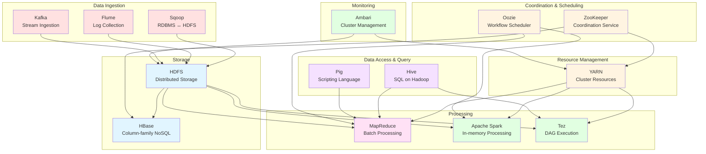
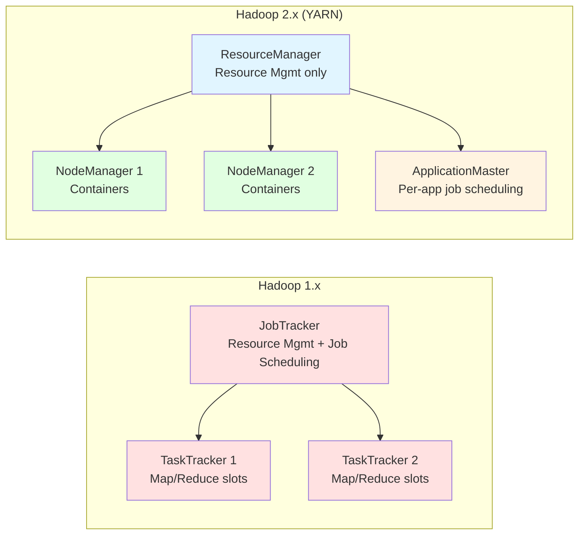
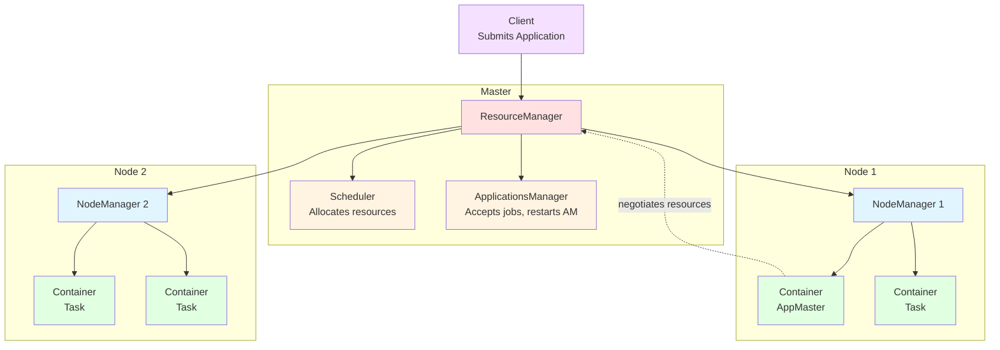
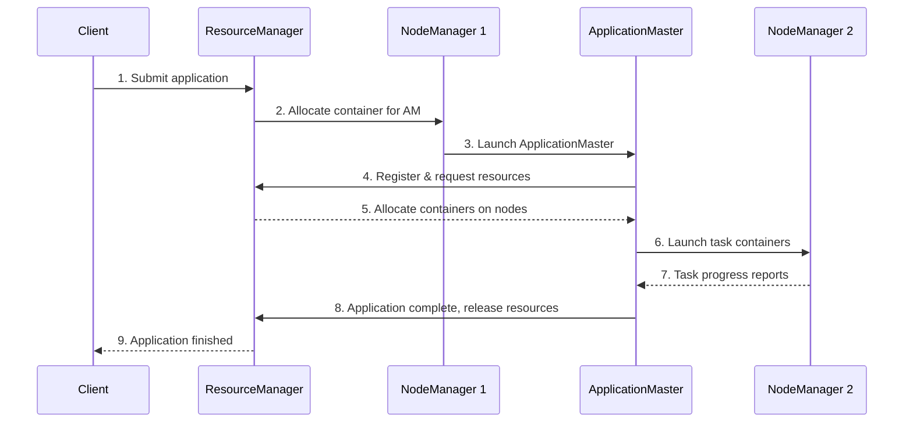

# Lesson 4. Apache Hadoop Ecosystem

> View [Ukrainian version](README_ua.md)

**Discipline:** BIG DATA (Processing of Very Large Data Sets)

**Content Module 1:** Big Data Engineering

**Duration:** 90 minutes (quiz ~10 min + theory ~40 min + practice ~40 min)

---

## Learning Objectives

After completing the lesson, students should be able to:

- understand the full Hadoop ecosystem and the role of each component;
- describe YARN architecture and how it manages cluster resources;
- explain the key advantages of Hadoop for big data processing;
- interact with HDFS and YARN using command-line tools in a Docker-based environment;
- navigate Hadoop Web UIs for cluster monitoring.

---

# PART I — THEORETICAL

---

## 1. Hadoop Ecosystem Overview (15 min)

### 1.1. Beyond the Core: The Full Hadoop Ecosystem


In Lesson 2, we introduced Hadoop's core components: HDFS, YARN, and MapReduce. But a production Hadoop cluster relies on a rich ecosystem of tools, each solving a specific problem in the data pipeline.



### 1.2. Ecosystem Components at a Glance

| Component | Purpose | Category |
|-----------|---------|----------|
| **HDFS** | Distributed file storage across a cluster | Storage |
| **YARN** | Cluster resource management and job scheduling | Resource Management |
| **MapReduce** | Batch processing using the map-reduce paradigm | Processing |
| **Apache Spark** | Fast in-memory data processing (batch + streaming) | Processing |
| **Tez** | DAG-based execution engine, faster than MapReduce for complex queries | Processing |
| **Hive** | SQL-like queries on data stored in HDFS | Data Access |
| **Pig** | High-level scripting language for data transformations | Data Access |
| **HBase** | Column-family NoSQL database on top of HDFS | Storage |
| **Sqoop** | Transfers data between RDBMS (MySQL, PostgreSQL) and HDFS | Ingestion |
| **Flume** | Collects and aggregates log data into HDFS | Ingestion |
| **Kafka** | Distributed streaming platform for real-time data ingestion | Ingestion |
| **ZooKeeper** | Coordination, configuration, and synchronization service | Coordination |
| **Oozie** | Workflow scheduler for Hadoop jobs | Coordination |
| **Ambari** | Web UI for provisioning, managing, and monitoring Hadoop clusters | Monitoring |

### 1.3. How the Pieces Fit Together

A typical data pipeline through the Hadoop ecosystem:

1. **Ingest** — Sqoop imports data from relational databases; Flume collects logs from servers; Kafka streams real-time events
2. **Store** — raw data lands in HDFS; frequently-accessed structured data may go into HBase
3. **Process** — YARN allocates cluster resources; MapReduce, Spark, or Tez execute computation
4. **Query** — analysts use Hive (SQL) or Pig (scripting) to explore processed data
5. **Orchestrate** — Oozie chains multiple jobs into workflows; ZooKeeper coordinates distributed services
6. **Monitor** — Ambari provides a dashboard for cluster health, resource usage, and alerting

---

## 2. YARN — Yet Another Resource Negotiator (20 min)

### 2.1. Why YARN Was Needed

In Hadoop 1.x, MapReduce handled both resource management and job execution. This created serious limitations:

- **Scalability bottleneck** — the single JobTracker managed all tasks, limiting clusters to ~4,000 nodes
- **Only MapReduce** — no support for other processing models (Spark, Tez, streaming)
- **Poor resource utilization** — fixed map/reduce slots led to idle resources

Hadoop 2.0 introduced YARN to separate these concerns:



### 2.2. YARN Architecture

YARN has four main components:



**ResourceManager (RM)** — the master daemon, runs on a dedicated node:
- **Scheduler** — allocates resources (CPU, memory) to applications based on policies (Capacity Scheduler, Fair Scheduler). It does NOT monitor or restart tasks.
- **ApplicationsManager** — accepts job submissions, negotiates the first container for the ApplicationMaster, and restarts it on failure.

**NodeManager (NM)** — runs on every worker node:
- Manages containers (isolated execution environments) on its node
- Monitors resource usage (CPU, memory, disk, network) per container
- Sends heartbeats and resource reports to the ResourceManager
- Kills containers that exceed their allocated resources

**ApplicationMaster (AM)** — one per application:
- Negotiates resources (containers) from the ResourceManager
- Works with NodeManagers to launch and monitor tasks
- Handles task failures (re-runs failed tasks)
- Different frameworks provide different AMs: MapReduce has `MRAppMaster`, Spark has its own AM

**Container** — the basic unit of resource allocation:
- An isolated allocation of CPU cores and memory on a specific node
- Each task (map, reduce, Spark executor) runs inside a container
- Containers are created by NodeManagers on request from the ApplicationMaster

### 2.3. YARN Application Lifecycle



**Step by step:**

1. The client submits an application (e.g., a MapReduce job or Spark application) to the ResourceManager
2. The ResourceManager asks a NodeManager to allocate a container for the ApplicationMaster
3. The NodeManager launches the ApplicationMaster in the container
4. The ApplicationMaster registers with the ResourceManager and requests resources for tasks
5. The ResourceManager allocates containers based on available resources and scheduling policy
6. The ApplicationMaster contacts NodeManagers to launch tasks in the allocated containers
7. Tasks run and report progress back to the ApplicationMaster
8. When all tasks complete, the ApplicationMaster notifies the ResourceManager and releases resources
9. The client can query the ResourceManager or ApplicationMaster for status at any time

### 2.4. YARN Schedulers

YARN supports pluggable scheduling policies:

| Scheduler | Behavior | Use Case |
|-----------|----------|----------|
| **FIFO** | First-come, first-served queue | Testing only — a large job blocks everything |
| **Capacity Scheduler** | Multiple queues with guaranteed minimum capacity; queues can borrow idle resources | Multi-tenant production clusters (default in Apache Hadoop) |
| **Fair Scheduler** | Distributes resources equally among all running applications | Interactive workloads where every job should get a fair share |

---

## 3. Hadoop Advantages and Cluster Monitoring (5 min)

### 3.1. Key Advantages of Hadoop

| Advantage | Description |
|-----------|-------------|
| **Scalability** | Scale horizontally by adding commodity hardware — from 1 node to thousands |
| **Fault tolerance** | Data is replicated across nodes; failed tasks are automatically re-executed |
| **Cost-effectiveness** | Runs on commodity hardware instead of expensive specialized servers |
| **Data locality** | Moves computation to data rather than moving data to computation |
| **Flexibility** | Stores and processes any data format (structured, semi-structured, unstructured) |
| **Rich ecosystem** | Dozens of integrated tools for ingestion, processing, querying, and monitoring |
| **Multi-tenancy** | YARN allows multiple applications and frameworks to share the same cluster |

### 3.2. Monitoring Tools

**Built-in Hadoop Web UIs:**

| UI | Default URL | Shows |
|----|-------------|-------|
| NameNode UI | `http://namenode:9870` | HDFS status, capacity, DataNode health, file browser |
| ResourceManager UI | `http://resourcemanager:8088` | Running/completed applications, cluster resources, queue status |
| NodeManager UI | `http://nodemanager:8042` | Containers running on this node, logs |
| MapReduce History | `http://historyserver:19888` | Completed MapReduce job details, counters, logs |

**Third-party monitoring tools:**

- **Apache Ambari** — web-based tool for provisioning, managing, and monitoring Hadoop clusters. Provides dashboards, alerting, and configuration management.
- **Ganglia** — scalable distributed monitoring for clusters and grids. Shows CPU, memory, network, and disk metrics.
- **Grafana + Prometheus** — modern monitoring stack. Prometheus collects metrics; Grafana provides customizable dashboards. Widely used in production.
- **Cloudera Manager** — commercial tool (Cloudera distribution) for cluster administration and monitoring.

---

# PART II — PRACTICAL

---

## Exercise 1: Setting Up a Single-Node Hadoop Cluster with Docker (15 min)

**Goal:** run a Hadoop environment locally using Docker and explore the HDFS and YARN command-line tools.

### Prerequisites

- Docker installed and running on your machine
- At least 4 GB of free RAM
- Terminal / command line access

### Step 1. Pull and Start the Hadoop Container

```bash
# Pull a lightweight Hadoop image
docker pull sequenceiq/hadoop-docker:2.7.1

# Run the container with port forwarding for Web UIs
docker run -it \
  --name hadoop-sandbox \
  -p 9870:50070 \
  -p 8088:8088 \
  -p 19888:19888 \
  sequenceiq/hadoop-docker:2.7.1 \
  /etc/bootstrap.sh -bash
```

> **Note:** port 50070 is the NameNode UI port in Hadoop 2.x. We map it to 9870 on the host for convenience. Port 8088 is the ResourceManager UI.

You should now be inside the container with a running Hadoop cluster.

### Step 2. Verify the Cluster is Running

```bash
# Check HDFS status
hdfs dfsadmin -report

# Check YARN status
yarn node -list
```

Expected output should show 1 DataNode and 1 NodeManager in the cluster.

---

## Exercise 2: Working with HDFS CLI (10 min)

**Goal:** practice the most common HDFS file system operations.

### HDFS Command Reference

| Command | Description |
|---------|-------------|
| `hdfs dfs -ls /` | List files in the root directory |
| `hdfs dfs -mkdir /user/student` | Create a directory |
| `hdfs dfs -put local.txt /user/student/` | Upload a file from local to HDFS |
| `hdfs dfs -cat /user/student/local.txt` | Display file contents |
| `hdfs dfs -get /user/student/local.txt .` | Download a file from HDFS to local |
| `hdfs dfs -rm /user/student/local.txt` | Delete a file |
| `hdfs dfs -du -h /` | Show disk usage |

### Hands-on Tasks

```bash
# 1. Create a working directory in HDFS
hdfs dfs -mkdir -p /user/student/lesson4

# 2. Create a sample text file
echo "hadoop is a framework for distributed processing
big data requires distributed storage
yarn manages cluster resources efficiently
mapreduce splits work across many nodes
hdfs stores data with replication for fault tolerance" > sample.txt

# 3. Upload the file to HDFS
hdfs dfs -put sample.txt /user/student/lesson4/

# 4. Verify the upload
hdfs dfs -ls /user/student/lesson4/

# 5. View the file content from HDFS
hdfs dfs -cat /user/student/lesson4/sample.txt

# 6. Check block information
hdfs fsck /user/student/lesson4/sample.txt -files -blocks -locations

# 7. Check HDFS disk usage
hdfs dfs -du -h /user/student/
```

**Discussion:** observe the output of `hdfs fsck` — how many blocks does the file have? What replication factor is shown? On a single-node cluster, the effective replication is 1 even if configured as 3 (there is only one DataNode).

---

## Exercise 3: Running a MapReduce Job on YARN (10 min)

**Goal:** submit a MapReduce Word Count job to YARN and observe it in the ResourceManager UI.

### Step 1. Run the Word Count Example

```bash
# The Hadoop installation includes example jars
# Find the examples jar
EXAMPLES_JAR=$(find /usr/local/hadoop/share/hadoop/mapreduce/ \
  -name "hadoop-mapreduce-examples-*.jar" | head -1)

echo "Using: $EXAMPLES_JAR"

# Run Word Count on our sample file
hadoop jar $EXAMPLES_JAR wordcount \
  /user/student/lesson4/sample.txt \
  /user/student/lesson4/wordcount-output
```

### Step 2. Examine the Results

```bash
# List output files
hdfs dfs -ls /user/student/lesson4/wordcount-output/

# View the word count results
hdfs dfs -cat /user/student/lesson4/wordcount-output/part-r-00000
```

Expected output (sorted alphabetically by word):
```
a           1
across      1
big         1
cluster     1
data        2
distributed 2
fault       1
for         2
framework   1
hadoop      1
hdfs        1
is          1
manages     1
many        1
mapreduce   1
nodes       1
processing  1
replication 1
requires    1
resources   1
splits      1
storage     1
stores      1
tolerance   1
with        1
work        1
yarn        1
```

### Step 3. Observe YARN Application

```bash
# List completed applications
yarn application -list -appStates FINISHED

# Get details about the application (use the application ID from the list)
# yarn application -status application_XXXX_XXXX
```

---

## Exercise 4: Exploring Hadoop Web UIs (5 min)

**Goal:** use the built-in web interfaces to monitor the cluster.

### NameNode UI

Open in your browser: **http://localhost:9870**

Explore:
- **Overview** — cluster summary: capacity, number of DataNodes, blocks
- **Datanodes** — list of DataNodes with their status, capacity, and last heartbeat
- **Utilities → Browse the file system** — navigate HDFS like a file explorer; find your uploaded file and the word count output

### ResourceManager UI

Open in your browser: **http://localhost:8088**

Explore:
- **Cluster** — total resources (memory, vCores), active NodeManagers
- **Applications** — find your completed Word Count job; click on it to see:
  - Start time, finish time, elapsed time
  - Number of map and reduce tasks
  - Resource usage (memory-seconds, vcore-seconds)
- **Scheduler** — see the queue configuration and resource allocation

### Questions for Exploration

1. How much total HDFS capacity does your single-node cluster have?
2. In the ResourceManager UI, how much memory and how many vCores were allocated to your Word Count job?
3. Can you find the logs of your MapReduce tasks through the web UI?

---

## Cleanup

When you are done, exit the container and optionally remove it:

```bash
# Exit the container
exit

# Stop and remove the container
docker stop hadoop-sandbox
docker rm hadoop-sandbox
```

---

## Independent Work

**Topic:** YARN architecture and components. Key advantages of Hadoop and cluster monitoring tools.

### Tasks:

1. **Written Report** (2–3 pages):
   - Describe the YARN architecture: role and responsibilities of ResourceManager, NodeManager, ApplicationMaster, and Container
   - Draw a diagram of the YARN application lifecycle (from job submission to completion)
   - List at least 4 key advantages of using Hadoop and explain each briefly
   - Describe 2 monitoring tools for Hadoop clusters (what they show, when to use them)

2. **Practical Evidence**:
   - Provide screenshots of your Docker-based Hadoop environment:
     - `hdfs dfsadmin -report` output
     - The NameNode Web UI overview page
     - The ResourceManager Web UI showing your completed MapReduce job
   - Run a second MapReduce job using a different input text (create your own file with at least 5 lines) and include the output

3. **Additional** (optional, +2 points):
   - Research and write a comparison (0.5–1 page) of the three YARN schedulers (FIFO, Capacity, Fair): when would you choose each one?
   - Or: explore one additional Hadoop ecosystem tool (Hive, HBase, or Sqoop) and describe its purpose, architecture, and a basic usage example

### Grading Criteria:

| Component                                            | Points |
|------------------------------------------------------|--------|
| YARN architecture description with diagram           | 2      |
| Hadoop advantages (at least 4 with explanations)     | 1      |
| Monitoring tools description                         | 1      |
| Practical screenshots and second MapReduce job       | 1      |
| **Total**                                            | **5**  |

---

## Recommended Resources

- [Lesson 3 — MapReduce and HDFS](../lesson1-3/README.md)
- Apache Hadoop YARN Documentation: https://hadoop.apache.org/docs/stable/hadoop-yarn/hadoop-yarn-site/YARN.html
- YARN Architecture: https://hadoop.apache.org/docs/stable/hadoop-yarn/hadoop-yarn-site/WritingYarnApplications.html
- Apache Hadoop Cluster Setup: https://hadoop.apache.org/docs/stable/hadoop-project-dist/hadoop-common/ClusterSetup.html
- Docker Hadoop Image: https://hub.docker.com/r/sequenceiq/hadoop-docker
- Apache Ambari: https://ambari.apache.org/
- Hadoop: The Definitive Guide (Tom White) — Chapters on YARN
