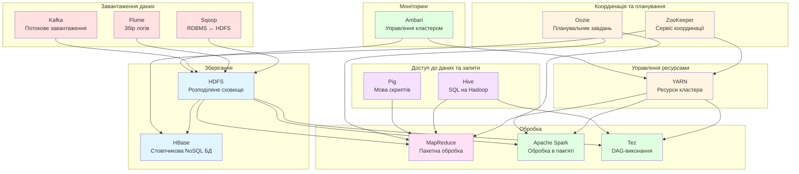
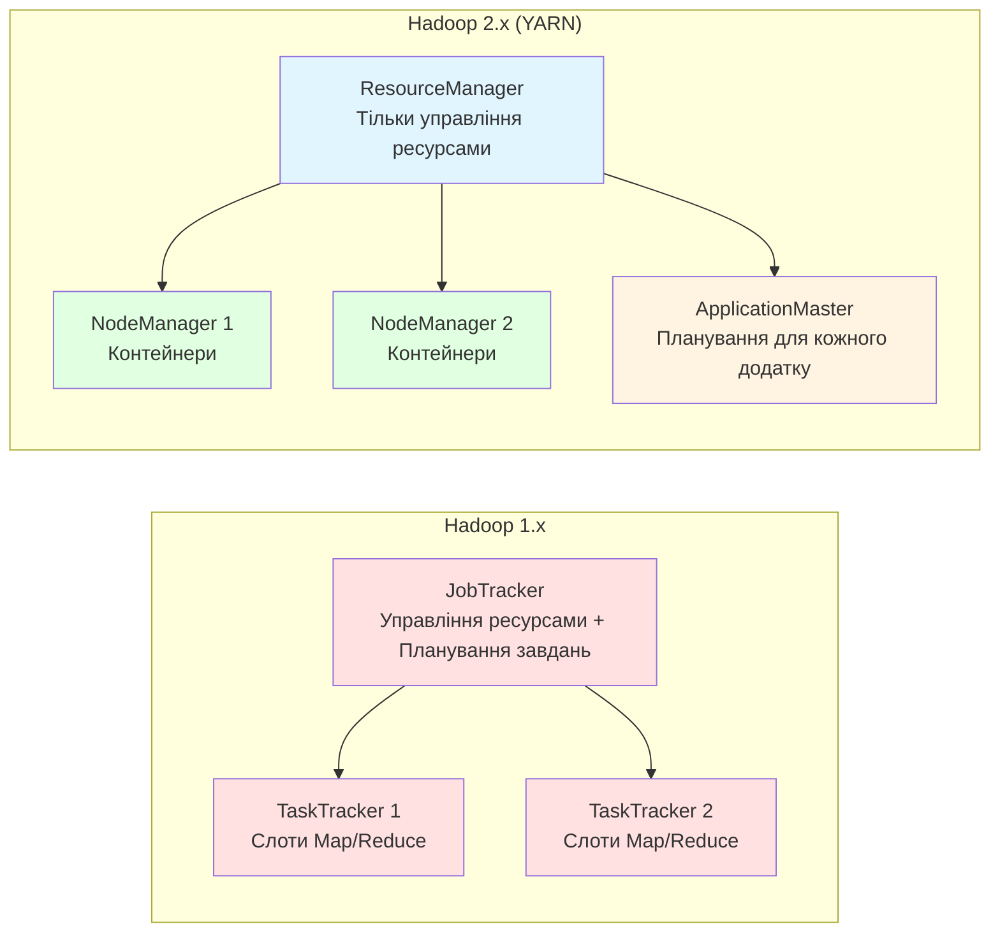
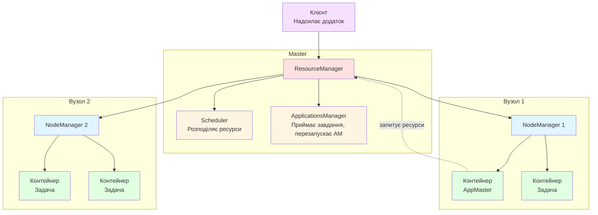
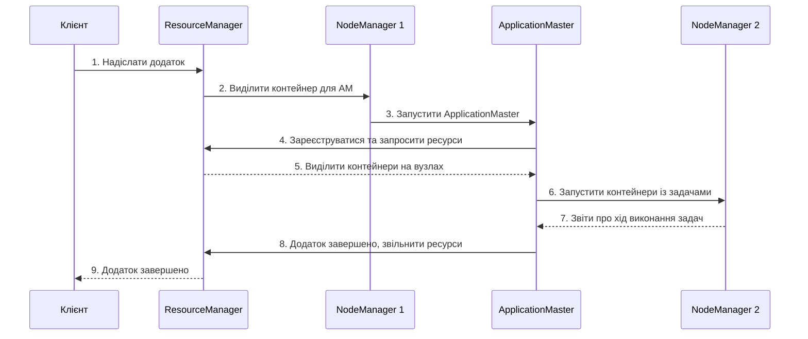

# Заняття 4. Екосистема Apache Hadoop

> Подивитись [версію англійською](README.md)

**Дисципліна:** BIG DATA (Обробка надвеликих масивів даних)

**Змістовий модуль 1:** Інженерія великих наборів даних

**Тривалість:** 90 хвилин (квіз ~10 хв + теорія ~40 хв + практика ~40 хв)

---

## Навчальні цілі

Після завершення заняття здобувачі повинні:

- розуміти повну екосистему Hadoop та роль кожного компонента;
- описувати архітектуру YARN та принципи управління ресурсами кластера;
- пояснювати ключові переваги Hadoop для обробки великих даних;
- працювати з HDFS та YARN за допомогою командного рядка в середовищі Docker;
- орієнтуватися у веб-інтерфейсах Hadoop для моніторингу кластера.

---

# ЧАСТИНА І — ТЕОРЕТИЧНА

---

## 1. Огляд екосистеми Hadoop (15 хв)

### 1.1. За межами ядра: повна екосистема Hadoop

На занятті 2 ми розглянули основні компоненти Hadoop: HDFS, YARN та MapReduce. Однак у виробничому кластері Hadoop використовується багата екосистема інструментів, кожен з яких вирішує конкретну задачу в конвеєрі обробки даних.



### 1.2. Компоненти екосистеми

| Компонент | Призначення | Категорія |
|-----------|-------------|-----------|
| **HDFS** | Розподілене файлове сховище на кластері | Зберігання |
| **YARN** | Управління ресурсами кластера та планування завдань | Управління ресурсами |
| **MapReduce** | Пакетна обробка за парадигмою map-reduce | Обробка |
| **Apache Spark** | Швидка обробка даних в пам'яті (пакетна + потокова) | Обробка |
| **Tez** | Движок виконання на основі DAG, швидший за MapReduce для складних запитів | Обробка |
| **Hive** | SQL-подібні запити до даних у HDFS | Доступ до даних |
| **Pig** | Високорівнева мова скриптів для трансформації даних | Доступ до даних |
| **HBase** | Стовпчикова NoSQL база даних поверх HDFS | Зберігання |
| **Sqoop** | Передача даних між RDBMS (MySQL, PostgreSQL) та HDFS | Завантаження |
| **Flume** | Збір та агрегація логів у HDFS | Завантаження |
| **Kafka** | Розподілена потокова платформа для завантаження даних у реальному часі | Завантаження |
| **ZooKeeper** | Сервіс координації, конфігурації та синхронізації | Координація |
| **Oozie** | Планувальник робочих процесів для завдань Hadoop | Координація |
| **Ambari** | Веб-інтерфейс для розгортання, управління та моніторингу кластерів Hadoop | Моніторинг |

### 1.3. Як компоненти працюють разом

Типовий конвеєр обробки даних в екосистемі Hadoop:

1. **Завантаження** — Sqoop імпортує дані з реляційних баз; Flume збирає логи з серверів; Kafka передає події в реальному часі
2. **Зберігання** — сирі дані потрапляють у HDFS; структуровані дані з частим доступом можуть зберігатися в HBase
3. **Обробка** — YARN виділяє ресурси кластера; MapReduce, Spark або Tez виконують обчислення
4. **Запити** — аналітики використовують Hive (SQL) або Pig (скрипти) для дослідження оброблених даних
5. **Оркестрація** — Oozie об'єднує кілька завдань у робочі процеси; ZooKeeper координує розподілені сервіси
6. **Моніторинг** — Ambari надає панель для спостереження за станом кластера, використанням ресурсів та сповіщеннями

---

## 2. YARN — Yet Another Resource Negotiator (20 хв)

### 2.1. Навіщо був потрібен YARN

У Hadoop 1.x MapReduce відповідав і за управління ресурсами, і за виконання завдань. Це створювало серйозні обмеження:

- **Вузьке місце масштабування** — єдиний JobTracker керував усіма задачами, обмежуючи кластери до ~4000 вузлів
- **Тільки MapReduce** — відсутність підтримки інших моделей обробки (Spark, Tez, потокова обробка)
- **Неефективне використання ресурсів** — фіксовані слоти map/reduce призводили до простою ресурсів

Hadoop 2.0 представив YARN для розділення цих обов'язків:



### 2.2. Архітектура YARN

YARN має чотири основних компоненти:



**ResourceManager (RM)** — головний демон, працює на виділеному вузлі:
- **Scheduler (Планувальник)** — розподіляє ресурси (CPU, пам'ять) між додатками на основі політик (Capacity Scheduler, Fair Scheduler). НЕ здійснює моніторинг і не перезапускає задачі.
- **ApplicationsManager** — приймає запити на запуск завдань, виділяє перший контейнер для ApplicationMaster та перезапускає його у разі збою.

**NodeManager (NM)** — працює на кожному робочому вузлі:
- Керує контейнерами (ізольованими середовищами виконання) на своєму вузлі
- Моніторить використання ресурсів (CPU, пам'ять, диск, мережа) для кожного контейнера
- Надсилає heartbeat-повідомлення та звіти про ресурси до ResourceManager
- Зупиняє контейнери, що перевищують виділені ресурси

**ApplicationMaster (AM)** — один на кожний додаток:
- Запитує ресурси (контейнери) у ResourceManager
- Працює з NodeManager для запуску та моніторингу задач
- Обробляє збої задач (перезапускає невдалі задачі)
- Різні фреймворки мають різні AM: MapReduce має `MRAppMaster`, Spark має власний AM

**Container (Контейнер)** — базова одиниця виділення ресурсів:
- Ізольований блок ресурсів CPU та пам'яті на конкретному вузлі
- Кожна задача (map, reduce, Spark executor) виконується всередині контейнера
- Контейнери створюються NodeManager за запитом від ApplicationMaster

### 2.3. Життєвий цикл додатку в YARN



**Покроково:**

1. Клієнт надсилає додаток (наприклад, MapReduce-завдання або Spark-додаток) до ResourceManager
2. ResourceManager просить NodeManager виділити контейнер для ApplicationMaster
3. NodeManager запускає ApplicationMaster у контейнері
4. ApplicationMaster реєструється в ResourceManager та запитує ресурси для задач
5. ResourceManager виділяє контейнери на основі доступних ресурсів та політики планування
6. ApplicationMaster зв'язується з NodeManager для запуску задач у виділених контейнерах
7. Задачі виконуються та повідомляють про хід виконання ApplicationMaster
8. Коли всі задачі завершені, ApplicationMaster сповіщає ResourceManager та звільняє ресурси
9. Клієнт може запитувати статус у ResourceManager або ApplicationMaster у будь-який момент

### 2.4. Планувальники YARN

YARN підтримує підключення різних політик планування:

| Планувальник | Поведінка | Випадок використання |
|--------------|-----------|---------------------|
| **FIFO** | Черга «першим прийшов — першим обслужений» | Лише для тестування — велике завдання блокує все інше |
| **Capacity Scheduler** | Кілька черг з гарантованою мінімальною ємністю; черги можуть запозичувати вільні ресурси | Виробничі кластери з кількома орендарями (за замовчуванням в Apache Hadoop) |
| **Fair Scheduler** | Рівномірно розподіляє ресурси між усіма запущеними додатками | Інтерактивні навантаження, де кожне завдання повинно отримати справедливу частку |

---

## 3. Переваги Hadoop та моніторинг кластера (5 хв)

### 3.1. Ключові переваги Hadoop

| Перевага | Опис |
|----------|------|
| **Масштабованість** | Горизонтальне масштабування додаванням стандартного обладнання — від 1 вузла до тисяч |
| **Відмовостійкість** | Дані реплікуються між вузлами; невдалі задачі автоматично перезапускаються |
| **Економічність** | Працює на стандартному обладнанні замість дорогих спеціалізованих серверів |
| **Локальність даних** | Переміщує обчислення до даних, а не дані до обчислень |
| **Гнучкість** | Зберігає та обробляє дані будь-якого формату (структуровані, напівструктуровані, неструктуровані) |
| **Багата екосистема** | Десятки інтегрованих інструментів для завантаження, обробки, запитів та моніторингу |
| **Мультиорендність** | YARN дозволяє кільком додаткам та фреймворкам спільно використовувати один кластер |

### 3.2. Засоби моніторингу

**Вбудовані веб-інтерфейси Hadoop:**

| Інтерфейс | URL за замовчуванням | Що показує |
|-----------|---------------------|------------|
| NameNode UI | `http://namenode:9870` | Статус HDFS, ємність, стан DataNode, браузер файлів |
| ResourceManager UI | `http://resourcemanager:8088` | Запущені/завершені додатки, ресурси кластера, стан черг |
| NodeManager UI | `http://nodemanager:8042` | Контейнери на цьому вузлі, логи |
| MapReduce History | `http://historyserver:19888` | Деталі завершених MapReduce-завдань, лічильники, логи |

**Сторонні засоби моніторингу:**

- **Apache Ambari** — веб-інструмент для розгортання, управління та моніторингу кластерів Hadoop. Надає панелі, сповіщення та управління конфігурацією.
- **Ganglia** — масштабована розподілена система моніторингу для кластерів. Показує метрики CPU, пам'яті, мережі та дисків.
- **Grafana + Prometheus** — сучасний стек моніторингу. Prometheus збирає метрики; Grafana надає налаштовувані панелі. Широко використовується у виробництві.
- **Cloudera Manager** — комерційний інструмент (дистрибутив Cloudera) для адміністрування та моніторингу кластерів.

---

# ЧАСТИНА ІІ — ПРАКТИЧНА

---

## Вправа 1: Розгортання одновузлового кластера Hadoop у Docker (15 хв)

**Мета:** запустити середовище Hadoop локально за допомогою Docker та ознайомитися з інструментами командного рядка HDFS та YARN.

### Передумови

- Docker встановлено та запущено на вашому комп'ютері
- Щонайменше 4 ГБ вільної оперативної пам'яті
- Доступ до терміналу / командного рядка

### Крок 1. Завантаження та запуск контейнера Hadoop

```bash
# Завантажити легкий образ Hadoop
docker pull sequenceiq/hadoop-docker:2.7.1

# Запустити контейнер з прокиданням портів для веб-інтерфейсів
docker run -it \
  --name hadoop-sandbox \
  -p 9870:50070 \
  -p 8088:8088 \
  -p 19888:19888 \
  sequenceiq/hadoop-docker:2.7.1 \
  /etc/bootstrap.sh -bash
```

> **Примітка:** порт 50070 — це порт веб-інтерфейсу NameNode в Hadoop 2.x. Ми прокидаємо його на порт 9870 хоста для зручності. Порт 8088 — веб-інтерфейс ResourceManager.

Тепер ви повинні бути всередині контейнера з працюючим кластером Hadoop.

### Крок 2. Перевірка роботи кластера

```bash
# Перевірити статус HDFS
hdfs dfsadmin -report

# Перевірити статус YARN
yarn node -list
```

Очікуваний результат повинен показати 1 DataNode та 1 NodeManager у кластері.

---

## Вправа 2: Робота з командним рядком HDFS (10 хв)

**Мета:** практика найпоширеніших операцій файлової системи HDFS.

### Довідник команд HDFS

| Команда | Опис |
|---------|------|
| `hdfs dfs -ls /` | Перелік файлів у кореневому каталозі |
| `hdfs dfs -mkdir /user/student` | Створити каталог |
| `hdfs dfs -put local.txt /user/student/` | Завантажити файл з локальної ФС в HDFS |
| `hdfs dfs -cat /user/student/local.txt` | Показати вміст файлу |
| `hdfs dfs -get /user/student/local.txt .` | Завантажити файл з HDFS на локальну ФС |
| `hdfs dfs -rm /user/student/local.txt` | Видалити файл |
| `hdfs dfs -du -h /` | Показати використання дискового простору |

### Практичні завдання

```bash
# 1. Створити робочий каталог у HDFS
hdfs dfs -mkdir -p /user/student/lesson4

# 2. Створити зразковий текстовий файл
echo "hadoop is a framework for distributed processing
big data requires distributed storage
yarn manages cluster resources efficiently
mapreduce splits work across many nodes
hdfs stores data with replication for fault tolerance" > sample.txt

# 3. Завантажити файл у HDFS
hdfs dfs -put sample.txt /user/student/lesson4/

# 4. Перевірити завантаження
hdfs dfs -ls /user/student/lesson4/

# 5. Переглянути вміст файлу з HDFS
hdfs dfs -cat /user/student/lesson4/sample.txt

# 6. Перевірити інформацію про блоки
hdfs fsck /user/student/lesson4/sample.txt -files -blocks -locations

# 7. Перевірити використання дискового простору HDFS
hdfs dfs -du -h /user/student/
```

**Обговорення:** зверніть увагу на вивід `hdfs fsck` — скільки блоків має файл? Який фактор реплікації показано? На одновузловому кластері ефективна реплікація дорівнює 1, навіть якщо налаштовано 3 (є лише один DataNode).

---

## Вправа 3: Запуск MapReduce-завдання на YARN (10 хв)

**Мета:** надіслати MapReduce-завдання Word Count до YARN та спостерігати за ним у веб-інтерфейсі ResourceManager.

### Крок 1. Запуск прикладу Word Count

```bash
# Інсталяція Hadoop включає jar-файли з прикладами
# Знайти jar з прикладами
EXAMPLES_JAR=$(find /usr/local/hadoop/share/hadoop/mapreduce/ \
  -name "hadoop-mapreduce-examples-*.jar" | head -1)

echo "Використовується: $EXAMPLES_JAR"

# Запустити Word Count на нашому зразковому файлі
hadoop jar $EXAMPLES_JAR wordcount \
  /user/student/lesson4/sample.txt \
  /user/student/lesson4/wordcount-output
```

### Крок 2. Перегляд результатів

```bash
# Перелік файлів результату
hdfs dfs -ls /user/student/lesson4/wordcount-output/

# Переглянути результати підрахунку слів
hdfs dfs -cat /user/student/lesson4/wordcount-output/part-r-00000
```

Очікуваний вивід (відсортовано за алфавітом):
```
a           1
across      1
big         1
cluster     1
data        2
distributed 2
fault       1
for         2
framework   1
hadoop      1
hdfs        1
is          1
manages     1
many        1
mapreduce   1
nodes       1
processing  1
replication 1
requires    1
resources   1
splits      1
storage     1
stores      1
tolerance   1
with        1
work        1
yarn        1
```

### Крок 3. Спостереження за додатком у YARN

```bash
# Перелік завершених додатків
yarn application -list -appStates FINISHED

# Отримати деталі про додаток (використайте ID додатку зі списку)
# yarn application -status application_XXXX_XXXX
```

---

## Вправа 4: Дослідження веб-інтерфейсів Hadoop (5 хв)

**Мета:** використати вбудовані веб-інтерфейси для моніторингу кластера.

### Інтерфейс NameNode

Відкрийте у браузері: **http://localhost:9870**

Дослідіть:
- **Overview** — зведення по кластеру: ємність, кількість DataNode, блоки
- **Datanodes** — список DataNode з їхнім статусом, ємністю та останнім heartbeat
- **Utilities → Browse the file system** — навігація по HDFS як у файловому провіднику; знайдіть завантажений файл та результати word count

### Інтерфейс ResourceManager

Відкрийте у браузері: **http://localhost:8088**

Дослідіть:
- **Cluster** — загальні ресурси (пам'ять, vCores), активні NodeManager
- **Applications** — знайдіть завершене завдання Word Count; натисніть на нього, щоб побачити:
  - Час початку, час завершення, тривалість
  - Кількість map та reduce задач
  - Використання ресурсів (memory-seconds, vcore-seconds)
- **Scheduler** — конфігурація черг та розподіл ресурсів

### Питання для дослідження

1. Яка загальна ємність HDFS у вашому одновузловому кластері?
2. У веб-інтерфейсі ResourceManager, скільки пам'яті та vCores було виділено для вашого завдання Word Count?
3. Чи можете ви знайти логи ваших MapReduce-задач через веб-інтерфейс?

---

## Очищення

Після завершення роботи вийдіть з контейнера та за бажанням видаліть його:

```bash
# Вийти з контейнера
exit

# Зупинити та видалити контейнер
docker stop hadoop-sandbox
docker rm hadoop-sandbox
```

---

## Самостійна робота

**Тема:** Архітектура та компоненти YARN. Головні переваги використання Hadoop та засоби моніторингу у кластері Hadoop.

### Завдання:

1. **Письмовий звіт** (2–3 сторінки):
   - Опишіть архітектуру YARN: роль та обов'язки ResourceManager, NodeManager, ApplicationMaster та Container
   - Намалюйте діаграму життєвого циклу додатку в YARN (від надсилання завдання до завершення)
   - Перелічіть щонайменше 4 ключові переваги використання Hadoop та коротко поясніть кожну
   - Опишіть 2 засоби моніторингу для кластерів Hadoop (що вони показують, коли їх використовувати)

2. **Практичне підтвердження**:
   - Надайте скріншоти вашого середовища Hadoop у Docker:
     - Вивід `hdfs dfsadmin -report`
     - Головна сторінка веб-інтерфейсу NameNode
     - Веб-інтерфейс ResourceManager із завершеним MapReduce-завданням
   - Запустіть друге MapReduce-завдання з іншим вхідним текстом (створіть власний файл щонайменше з 5 рядків) та включіть результат

3. **Додатково** (за бажанням, +2 бали):
   - Дослідіть та напишіть порівняння (0.5–1 сторінка) трьох планувальників YARN (FIFO, Capacity, Fair): коли б ви обрали кожен з них?
   - Або: дослідіть один додатковий інструмент екосистеми Hadoop (Hive, HBase або Sqoop) та опишіть його призначення, архітектуру та базовий приклад використання

### Критерії оцінювання:

| Компонент                                                | Бали   |
|----------------------------------------------------------|--------|
| Опис архітектури YARN з діаграмою                        | 2      |
| Переваги Hadoop (щонайменше 4 з поясненнями)             | 1      |
| Опис засобів моніторингу                                 | 1      |
| Практичні скріншоти та друге MapReduce-завдання           | 1      |
| **Разом**                                                | **5**  |

---

## Рекомендовані ресурси

- [Заняття 3 — MapReduce та HDFS](../lesson1-3/README.md)
- Документація Apache Hadoop YARN: https://hadoop.apache.org/docs/stable/hadoop-yarn/hadoop-yarn-site/YARN.html
- Архітектура YARN: https://hadoop.apache.org/docs/stable/hadoop-yarn/hadoop-yarn-site/WritingYarnApplications.html
- Налаштування кластера Apache Hadoop: https://hadoop.apache.org/docs/stable/hadoop-project-dist/hadoop-common/ClusterSetup.html
- Docker-образ Hadoop: https://hub.docker.com/r/sequenceiq/hadoop-docker
- Apache Ambari: https://ambari.apache.org/
- Hadoop: The Definitive Guide (Tom White) — розділи про YARN
