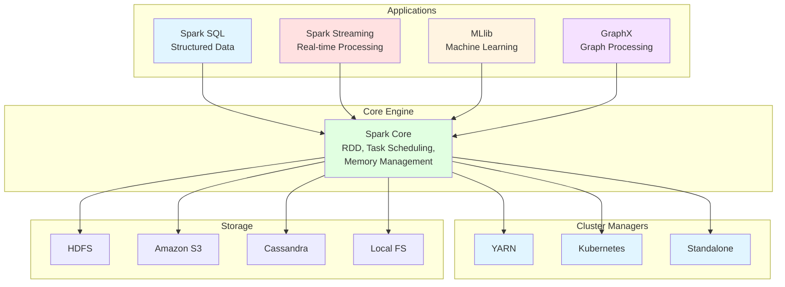
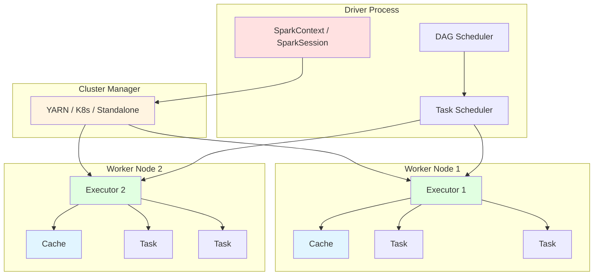
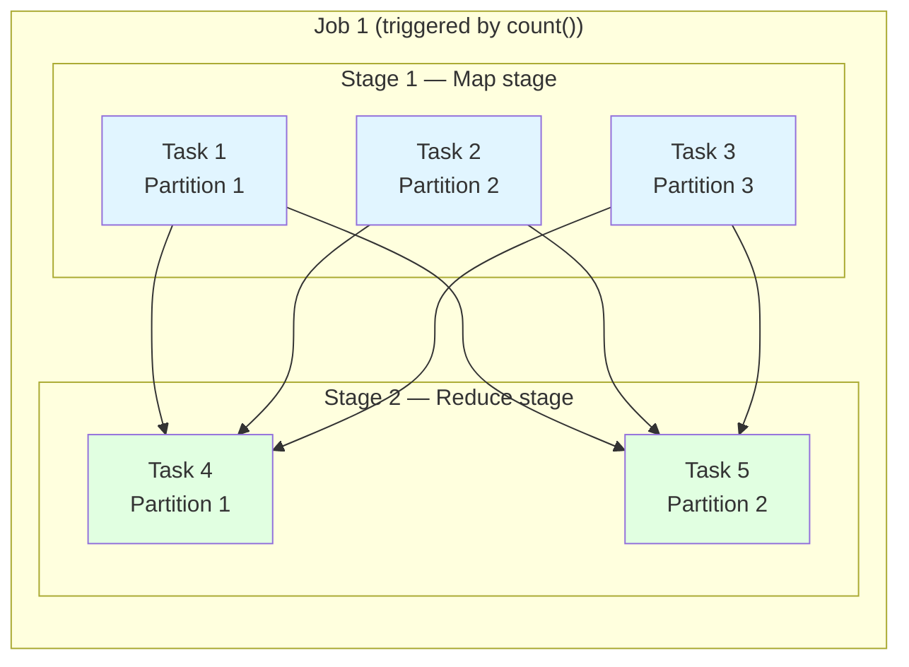
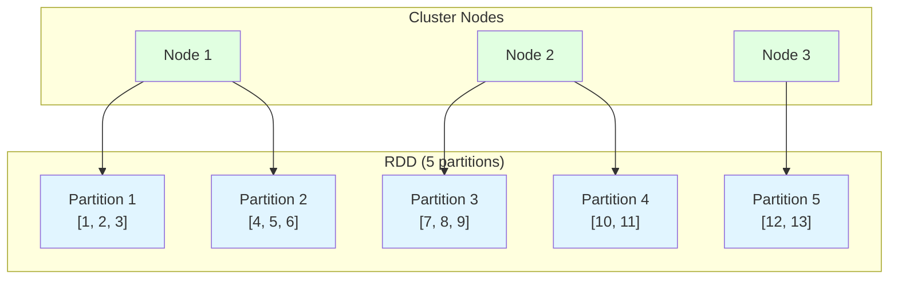
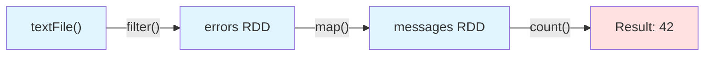
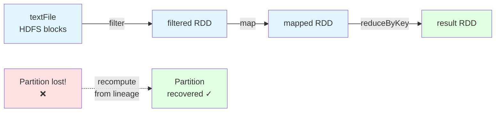
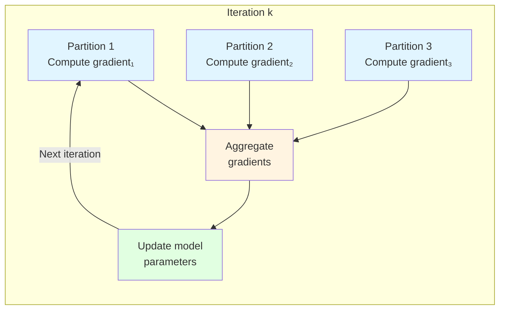

# Lesson 2-1. Apache Spark

> View [Ukrainian version](README_ua.md)

**Discipline:** BIG DATA (Processing of Very Large Data Sets)

**Content Module 2:** Apache Spark and Machine Learning on Big Data

**Type:** Lecture

**Duration:** 90 minutes (theory ~50 min + practice ~40 min)

**Maximum Score:** 2 points (active participation)

---

## Learning Objectives

After completing the lesson, students should be able to:

- explain Apache Spark architecture and name its core components;
- distinguish between SparkContext and SparkSession and know when to use each;
- define RDD and classify Spark operations into transformations and actions;
- compare Spark and MapReduce and articulate why Spark is faster for iterative workloads;
- describe the computational function problem in distributed systems;
- identify common data classification algorithms applicable to big data.

---

# PART I — THEORETICAL

---

## 1. Introduction to Apache Spark (10 min)

### 1.1. What is Apache Spark?

Apache Spark is a **unified analytics engine** for large-scale data processing. Originally developed at UC Berkeley's AMPLab in 2009, it was donated to the Apache Software Foundation in 2013 and has since become the most widely adopted big data processing framework.

**Key idea:** unlike MapReduce, which writes intermediate results to disk after every step, Spark keeps data **in memory** between operations. This makes it up to **100x faster** for iterative algorithms and interactive data exploration.

### 1.2. Spark vs. Hadoop — Positioning

Spark is **not a replacement for Hadoop** — it is a replacement for MapReduce as the processing engine. Spark can run:

- **On YARN** — using Hadoop's resource manager (most common in production)
- **On Kubernetes** — containerized deployment
- **Standalone** — Spark's own built-in cluster manager
- **On Mesos** — Apache Mesos resource manager (legacy)

Spark **still uses HDFS** (or other distributed storage) for persistent data. The Hadoop ecosystem (HDFS, YARN, Hive, HBase) remains relevant — Spark simply provides a faster, more flexible processing layer.



### 1.3. Spark Stack Components

| Component | Purpose | API |
|-----------|---------|-----|
| **Spark Core** | Task scheduling, memory management, fault recovery, RDD abstraction | RDD API |
| **Spark SQL** | Structured data processing with SQL and DataFrames | DataFrame / Dataset API |
| **Spark Streaming** | Micro-batch stream processing (also Structured Streaming for continuous) | DStream / Structured Streaming API |
| **MLlib** | Scalable machine learning (classification, regression, clustering, etc.) | Pipeline API |
| **GraphX** | Graph computation and analytics | Graph API |

---

## 2. Spark Architecture (15 min)

### 2.1. Driver and Executors

Every Spark application has the same high-level structure:



**Driver** — the process that runs `main()` and creates the SparkContext/SparkSession:
- Converts user code into a **DAG (Directed Acyclic Graph)** of stages and tasks
- Negotiates resources with the cluster manager
- Distributes tasks to executors and collects results
- Runs on the client machine (client mode) or inside the cluster (cluster mode)

**Executor** — a JVM process launched on worker nodes:
- Executes the tasks assigned by the driver
- Stores data in memory or on disk for caching
- Reports task status back to the driver
- Each executor has a fixed number of cores and a fixed amount of memory

**Cluster Manager** — allocates resources:
- In YARN mode, the ResourceManager assigns containers for the driver and executors
- The Spark ApplicationMaster runs inside a YARN container and negotiates executor containers

### 2.2. SparkContext vs SparkSession

**SparkContext** (Spark 1.x) — the original entry point to Spark:
- Connects to the cluster manager
- Creates RDDs and broadcast variables
- Manages accumulators
- One SparkContext per JVM

**SparkSession** (Spark 2.0+) — the **unified entry point** that combines SparkContext, SQLContext, and HiveContext:
- Provides access to DataFrames, Datasets, and SQL
- Internally creates and wraps a SparkContext
- Recommended API for all new applications

```python
# Spark 1.x style (SparkContext only)
from pyspark import SparkContext, SparkConf
conf = SparkConf().setAppName("MyApp").setMaster("local[*]")
sc = SparkContext(conf=conf)
rdd = sc.textFile("data.txt")

# Spark 2.0+ style (SparkSession — recommended)
from pyspark.sql import SparkSession
spark = SparkSession.builder \
    .appName("MyApp") \
    .master("local[*]") \
    .getOrCreate()

# Access SparkContext through SparkSession
sc = spark.sparkContext
rdd = sc.textFile("data.txt")

# Use DataFrames (preferred for structured data)
df = spark.read.csv("data.csv", header=True, inferSchema=True)
```

| Feature | SparkContext | SparkSession |
|---------|-------------|-------------|
| Introduced | Spark 1.0 | Spark 2.0 |
| API level | Low-level (RDD) | High-level (DataFrame, SQL) |
| Includes | Core functionality | Core + SQL + Hive + Streaming |
| Recommended | Legacy code only | All new applications |
| Multiple per JVM | No | Yes (via `newSession()`) |

### 2.3. Execution Model: Jobs, Stages, Tasks

When you run a Spark operation, the execution follows this hierarchy:

```
Application
  └── Job (triggered by an action, e.g., count(), collect())
        └── Stage (bounded by shuffle operations)
              └── Task (one per partition, runs on an executor)
```



**Key insight:** stages are separated by **shuffle boundaries** (operations that require data exchange between partitions, like `groupByKey`, `reduceByKey`, `join`). Within a stage, tasks run in parallel without data exchange.

---

## 3. RDD — Resilient Distributed Datasets (15 min)

### 3.1. What is an RDD?

An RDD (Resilient Distributed Dataset) is Spark's fundamental data abstraction — an **immutable, distributed collection** of objects that can be processed in parallel.

**Key properties:**
- **Resilient** — can be recreated from its lineage (the sequence of transformations that produced it) if a partition is lost
- **Distributed** — data is split into partitions across cluster nodes
- **Dataset** — a collection of records (can be any Python/Java/Scala object)



### 3.2. Creating RDDs

```python
# Method 1: Parallelize a local collection
data = [1, 2, 3, 4, 5, 6, 7, 8, 9, 10]
rdd = sc.parallelize(data, numSlices=4)  # 4 partitions

# Method 2: Load from external storage
rdd = sc.textFile("hdfs:///data/logs.txt")
rdd = sc.textFile("s3a://bucket/data.csv")

# Method 3: Transform an existing RDD
rdd2 = rdd.map(lambda x: x * 2)
```

### 3.3. Transformations vs Actions

This is the most important concept in Spark programming. All RDD operations fall into two categories:

**Transformations** — define a new RDD from an existing one. They are **lazy** — not executed until an action is called:

| Transformation | Description | Example |
|---------------|-------------|---------|
| `map(f)` | Apply function f to each element | `rdd.map(lambda x: x * 2)` |
| `filter(f)` | Keep elements where f returns True | `rdd.filter(lambda x: x > 5)` |
| `flatMap(f)` | Like map, but f can return 0 or more elements | `rdd.flatMap(lambda x: x.split(" "))` |
| `reduceByKey(f)` | Combine values for each key using f | `rdd.reduceByKey(lambda a, b: a + b)` |
| `groupByKey()` | Group values by key | `rdd.groupByKey()` |
| `sortByKey()` | Sort by key | `rdd.sortByKey()` |
| `join(other)` | Inner join two pair RDDs by key | `rdd1.join(rdd2)` |
| `distinct()` | Remove duplicates | `rdd.distinct()` |
| `union(other)` | Merge two RDDs | `rdd1.union(rdd2)` |

**Actions** — trigger computation and return a result to the driver or write to storage:

| Action | Description | Example |
|--------|-------------|---------|
| `collect()` | Return all elements to the driver | `rdd.collect()` |
| `count()` | Return the number of elements | `rdd.count()` |
| `first()` | Return the first element | `rdd.first()` |
| `take(n)` | Return first n elements | `rdd.take(5)` |
| `reduce(f)` | Aggregate all elements using f | `rdd.reduce(lambda a, b: a + b)` |
| `foreach(f)` | Apply f to each element (no return) | `rdd.foreach(print)` |
| `saveAsTextFile(path)` | Write to file | `rdd.saveAsTextFile("output/")` |
| `countByKey()` | Count elements per key | `rdd.countByKey()` |

### 3.4. Lazy Evaluation and DAG

Spark uses **lazy evaluation** — transformations are not executed immediately. Instead, Spark records them as a lineage graph (DAG). Only when an action is called does Spark plan and execute the computation.

```python
# Nothing happens yet — just building the DAG
lines = sc.textFile("access.log")                  # Transformation
errors = lines.filter(lambda l: "ERROR" in l)       # Transformation
error_messages = errors.map(lambda l: l.split("\t")[1])  # Transformation

# NOW Spark executes the entire chain
count = error_messages.count()                      # Action — triggers execution!
```



**Why lazy evaluation?**
- Spark can **optimize** the entire computation chain before executing it
- Unnecessary transformations can be skipped
- Stages can be pipelined (multiple transformations applied in a single pass over the data)

### 3.5. Persistence and Caching

By default, RDDs are recomputed every time an action is called on them. For RDDs that are reused across multiple actions, you can **persist** them in memory:

```python
# Cache in memory (default)
errors.cache()  # equivalent to errors.persist(StorageLevel.MEMORY_ONLY)

# First action — computes and caches
print(errors.count())  # 42

# Second action — reads from cache, no recomputation
print(errors.first())  # "2024-01-15 ERROR Connection timeout"
```

| Storage Level | Description |
|--------------|-------------|
| `MEMORY_ONLY` | Store as deserialized objects in JVM heap. Drop partitions that don't fit. |
| `MEMORY_AND_DISK` | Spill partitions that don't fit in memory to disk. |
| `DISK_ONLY` | Store all partitions on disk only. |
| `MEMORY_ONLY_SER` | Store as serialized bytes in memory (more space-efficient, more CPU). |
| `MEMORY_AND_DISK_SER` | Serialized in memory, spill to disk. |

### 3.6. RDD Lineage and Fault Tolerance

Unlike Hadoop, which replicates data for fault tolerance, Spark uses **lineage**. Each RDD remembers the transformations used to build it. If a partition is lost (executor failure), Spark recomputes only that partition from the parent RDD:



This approach is more efficient than replication for **compute-heavy workloads** — no extra storage or network overhead for replication.

---

## 4. Spark vs MapReduce (5 min)

### 4.1. Key Differences

| Aspect | MapReduce | Spark |
|--------|-----------|-------|
| **Processing model** | Disk-based: read → map → write → read → reduce → write | In-memory: keeps intermediate data in RAM |
| **Speed** | Slower — disk I/O between every stage | Up to 100x faster for iterative algorithms |
| **Ease of use** | Verbose Java code (mapper + reducer classes) | Concise API in Python, Scala, Java, R |
| **Iterative processing** | Poor — each iteration reads from / writes to disk | Excellent — cached RDDs avoid repeated disk I/O |
| **Real-time processing** | Batch only | Batch + micro-batch streaming + structured streaming |
| **DAG execution** | Fixed 2-phase (map → reduce) | Arbitrary DAG of stages |
| **Fault tolerance** | Data replication (HDFS) | RDD lineage (recomputation) |
| **Caching** | No built-in caching | In-memory caching of intermediate results |
| **Languages** | Java (primary) | Python, Scala, Java, R, SQL |

### 4.2. When to Use Each

**MapReduce is still appropriate when:**
- Processing very large datasets in a single pass (no iteration needed)
- Memory is limited and data doesn't fit in RAM
- Stability is more important than speed (MapReduce is extremely mature)
- The cluster is already running Hadoop without Spark

**Spark is preferred when:**
- Iterative algorithms (machine learning, graph processing)
- Interactive data exploration and analysis
- Stream processing requirements
- Complex multi-step data pipelines (ETL)
- SQL queries on large datasets (via Spark SQL)

### 4.3. Iterative Processing: The Key Advantage

The performance difference is most dramatic for iterative algorithms (e.g., machine learning, PageRank):

```mermaid
graph TB
    subgraph "MapReduce — Iterative"
        MR1["Iteration 1<br/>Read → Map → Reduce → Write to HDFS"]
        MR2["Iteration 2<br/>Read → Map → Reduce → Write to HDFS"]
        MR3["Iteration N<br/>Read → Map → Reduce → Write to HDFS"]
        MR1 -->|"disk I/O"| MR2
        MR2 -->|"disk I/O"| MR3
    end

    subgraph "Spark — Iterative"
        S0["Load data → Cache in memory"]
        S1["Iteration 1 (in-memory)"]
        S2["Iteration 2 (in-memory)"]
        S3["Iteration N (in-memory)"]
        S0 --> S1
        S1 -->|"no disk I/O"| S2
        S2 -->|"no disk I/O"| S3
    end

    style MR1 fill:#ffe1e1
    style MR2 fill:#ffe1e1
    style MR3 fill:#ffe1e1
    style S0 fill:#e1ffe1
    style S1 fill:#e1ffe1
    style S2 fill:#e1ffe1
    style S3 fill:#e1ffe1
```



---

## 5. The Computational Function Problem (5 min)

### 5.1. Problem Statement

The **computational function problem** (проблема обчислювальної функції) in distributed computing refers to the challenge of efficiently computing a function `f(D)` over a dataset `D` that is distributed across multiple nodes.

The core challenges are:

1. **Data locality** — moving data across the network is expensive. The ideal is to move the computation to the data, not the data to the computation.

2. **Partial aggregation** — not every function can be computed independently on partitions and then combined. For example:
   - `sum(D)` — **decomposable**: compute partial sums on each node, then sum the partial results
   - `mean(D)` — **partially decomposable**: requires both sum and count from each partition
   - `median(D)` — **not decomposable**: requires access to the full sorted dataset

3. **Communication overhead** — the shuffle phase (data exchange between nodes) is the most expensive operation in distributed processing. Minimizing shuffles is key to performance.

### 5.2. How Spark Addresses This

Spark mitigates the computational function problem through several mechanisms:

- **Lazy evaluation + DAG optimization** — Spark analyzes the entire computation graph before executing, minimizing unnecessary shuffles
- **Narrow vs wide dependencies** — narrow dependencies (map, filter) don't require shuffles; wide dependencies (groupByKey, join) do. Spark pipelines narrow dependencies into single stages
- **Partitioning** — users can control data partitioning to co-locate related data on the same node, reducing shuffles in joins
- **Broadcast variables** — small datasets can be sent to all nodes once, avoiding repeated network transfers
- **Accumulators** — enable efficient distributed counters and sums without shuffling

---

## 6. Data Classification and Big Data Algorithms (5 min)

### 6.1. Data Classification in Big Data Context

**Classification** is a supervised machine learning task — given labeled training data, build a model that predicts the class label for new, unseen data.

In the context of big data, classification presents unique challenges:
- Training data may be **too large** for a single machine's memory
- Model training may require **multiple passes** (iterations) over the data
- Feature space can be **extremely high-dimensional**
- Data may be **distributed** across a cluster, requiring specialized distributed algorithms

### 6.2. Classification Algorithms for Big Data

The following algorithms are implemented in Spark MLlib and designed for distributed execution:

| Algorithm | Type | How It Scales | Use Case |
|-----------|------|--------------|----------|
| **Logistic Regression** | Linear classifier | Distributed gradient descent, data-parallel | Binary/multi-class classification, interpretable models |
| **Decision Tree** | Tree-based | Level-wise training, distributed histogram aggregation | Non-linear relationships, feature importance |
| **Random Forest** | Ensemble of trees | Each tree trained on a data sample, trees in parallel | High accuracy, reduced overfitting |
| **Gradient-Boosted Trees (GBT)** | Ensemble, sequential | Each tree corrects errors of previous trees | Best accuracy for tabular data |
| **Naive Bayes** | Probabilistic | Single-pass aggregation of counts | Text classification, very fast training |
| **SVM (Linear)** | Linear classifier | Distributed optimization | High-dimensional sparse data |

### 6.3. How MLlib Distributes Training

Spark MLlib uses the **data-parallel** approach to scale machine learning:

1. **Data is partitioned** across cluster nodes
2. Each executor computes **local gradients** on its partition
3. Gradients are **aggregated** (reduced) across all nodes
4. The model parameters are **updated** using the aggregated gradient
5. Steps 2–4 are **iterated** until convergence

This is exactly where Spark's in-memory caching gives the biggest advantage — the training data stays cached in memory across iterations, while MapReduce would re-read it from disk each time.



### 6.4. Connection to Upcoming Practicals

In lessons 2-2 and 2-3, you will work hands-on with Spark:

- **Lesson 2-2** — setting up Apache Spark, working with RDDs and DataFrames, Spark Structured Streaming with Kafka for real-time cybersecurity analytics
- **Lesson 2-3** — training machine learning models with MLlib (classification, regression, clustering)

The practical materials are available in the [spark-tutorial](https://github.com) repository, which provides a complete containerized environment with Kafka, PostgreSQL, and Spark for cybersecurity event analysis.

---

# PART II — PRACTICAL

---

## Exercise 1: PySpark Interactive Session (15 min)

**Goal:** launch a PySpark shell and experiment with RDD transformations and actions.

### Prerequisites

- Python 3.10+ installed
- PySpark installed: `pip install pyspark`

### Step 1. Launch PySpark Shell

```bash
# Launch interactive PySpark shell
pyspark
```

You should see the Spark banner and a `>>>` prompt. A SparkSession named `spark` and a SparkContext named `sc` are automatically created.

### Step 2. Create and Transform RDDs

```python
# Create an RDD from a list
numbers = sc.parallelize([1, 2, 3, 4, 5, 6, 7, 8, 9, 10], 4)

# Check the number of partitions
print(f"Partitions: {numbers.getNumPartitions()}")  # 4

# Transformation: multiply each element by 2
doubled = numbers.map(lambda x: x * 2)

# Nothing has been computed yet! Let's trigger an action:
print(doubled.collect())  # [2, 4, 6, 8, 10, 12, 14, 16, 18, 20]

# Filter even numbers from the original RDD
evens = numbers.filter(lambda x: x % 2 == 0)
print(evens.collect())  # [2, 4, 6, 8, 10]

# Reduce: sum all elements
total = numbers.reduce(lambda a, b: a + b)
print(f"Sum: {total}")  # 55

# Count
print(f"Count: {numbers.count()}")  # 10
```

### Step 3. Word Count with RDD

```python
# Classic word count — compare with MapReduce!
text = sc.parallelize([
    "spark is fast and powerful",
    "spark supports python and scala",
    "big data processing with spark",
    "hadoop mapreduce is slower than spark"
])

# Step 1: Split lines into words (flatMap)
words = text.flatMap(lambda line: line.split(" "))

# Step 2: Create (word, 1) pairs (map)
pairs = words.map(lambda word: (word, 1))

# Step 3: Sum counts by key (reduceByKey)
counts = pairs.reduceByKey(lambda a, b: a + b)

# Step 4: Sort by count descending
sorted_counts = counts.sortBy(lambda x: -x[1])

# Action: collect and print results
for word, count in sorted_counts.collect():
    print(f"{word}: {count}")
```

Expected output:
```
spark: 4
and: 2
is: 2
fast: 1
powerful: 1
supports: 1
python: 1
scala: 1
big: 1
data: 1
processing: 1
with: 1
hadoop: 1
mapreduce: 1
slower: 1
than: 1
```

**Discussion:** compare this with the Hadoop MapReduce Word Count from Lesson 1-4. Note how the entire pipeline is expressed in 4 lines of code, versus writing separate Mapper and Reducer classes. The logic is identical — `flatMap` corresponds to the Mapper, `reduceByKey` corresponds to the Reducer — but the code is far more concise.

---

## Exercise 2: DataFrames and Spark SQL (15 min)

**Goal:** work with structured data using Spark's DataFrame API and SQL queries.

### Step 1. Create a DataFrame

```python
from pyspark.sql import SparkSession
from pyspark.sql.functions import col, avg, count, desc

# SparkSession is already created in pyspark shell as 'spark'

# Create a DataFrame from a list of tuples
data = [
    ("Alice", "Engineering", 85000),
    ("Bob", "Engineering", 92000),
    ("Charlie", "Marketing", 68000),
    ("Diana", "Marketing", 72000),
    ("Eve", "Engineering", 98000),
    ("Frank", "Sales", 61000),
    ("Grace", "Sales", 65000),
    ("Hank", "Engineering", 88000),
]

columns = ["name", "department", "salary"]
df = spark.createDataFrame(data, columns)

# Show the DataFrame
df.show()
# +-------+-----------+------+
# |   name| department|salary|
# +-------+-----------+------+
# |  Alice|Engineering| 85000|
# |    Bob|Engineering| 92000|
# |Charlie|  Marketing| 68000|
# ...
```

### Step 2. DataFrame Operations

```python
# Filter: employees with salary > 80000
high_earners = df.filter(col("salary") > 80000)
high_earners.show()

# Group by department: average salary and count
dept_stats = df.groupBy("department") \
    .agg(
        avg("salary").alias("avg_salary"),
        count("*").alias("employee_count")
    ) \
    .orderBy(desc("avg_salary"))

dept_stats.show()
# +-----------+----------+--------------+
# | department|avg_salary|employee_count|
# +-----------+----------+--------------+
# |Engineering|   90750.0|             4|
# |  Marketing|   70000.0|             2|
# |      Sales|   63000.0|             2|
# +-----------+----------+--------------+
```

### Step 3. Spark SQL

```python
# Register the DataFrame as a temporary SQL view
df.createOrReplaceTempView("employees")

# Run SQL queries directly
result = spark.sql("""
    SELECT department,
           AVG(salary) AS avg_salary,
           MAX(salary) AS max_salary,
           MIN(salary) AS min_salary
    FROM employees
    GROUP BY department
    ORDER BY avg_salary DESC
""")
result.show()

# Find employees earning above their department's average
above_avg = spark.sql("""
    SELECT e.name, e.department, e.salary, d.avg_salary
    FROM employees e
    JOIN (
        SELECT department, AVG(salary) AS avg_salary
        FROM employees
        GROUP BY department
    ) d ON e.department = d.department
    WHERE e.salary > d.avg_salary
""")
above_avg.show()
```

---

## Exercise 3: Comparing Execution Plans (10 min)

**Goal:** understand how Spark optimizes execution using the Catalyst optimizer.

```python
# The explain() method shows the execution plan
df.filter(col("salary") > 80000) \
  .groupBy("department") \
  .count() \
  .explain(True)
```

This prints the execution plan with four phases:
1. **Parsed Logical Plan** — what the user wrote
2. **Analyzed Logical Plan** — with resolved column names and types
3. **Optimized Logical Plan** — after Catalyst optimizations (predicate pushdown, etc.)
4. **Physical Plan** — the actual execution plan with specific operators

**Discussion points:**
- Notice how the filter is applied **before** the groupBy (predicate pushdown)
- DataFrames are optimized by Catalyst; RDDs are not — the user is responsible for optimization
- This is a key reason to prefer DataFrames over RDDs for structured data

---

## Independent Work

**Topic:** Apache Spark features, Spark vs MapReduce comparison, and data classification algorithms.

### Tasks:

1. **Written answers** (2–3 pages):
   - Describe the computational function problem (проблема обчислювальної функції). Why is `median()` harder to compute in a distributed system than `sum()`?
   - Classify data types (structured, semi-structured, unstructured) and give 2 examples of each
   - Compare at least 3 classification algorithms suitable for big data (from the lecture table). For each, explain when it would be the best choice
   - List the main differences between Spark and MapReduce. Why is Spark faster for iterative algorithms?

2. **Practical** (optional, +1 point):
   - Install PySpark locally and run the Word Count example from Exercise 1
   - Provide a screenshot of the PySpark shell with the output

### Grading Criteria:

| Component | Points |
|-----------|--------|
| Active participation in lecture and exercises | 1 |
| Quality of written answers | 1 |
| **Total** | **2** |

---

## Recommended Resources

- [Lesson 1-4 — Apache Hadoop Ecosystem](../lesson1-4/README.md)
- [Lesson 1-5 — Setting Up and Working with Apache Hadoop](../lesson1-5/README.md)
- Apache Spark Documentation: https://spark.apache.org/docs/latest/
- PySpark API Reference: https://spark.apache.org/docs/latest/api/python/
- Spark RDD Programming Guide: https://spark.apache.org/docs/latest/rdd-programming-guide.html
- Spark SQL Guide: https://spark.apache.org/docs/latest/sql-programming-guide.html
- MLlib Guide: https://spark.apache.org/docs/latest/ml-guide.html
- Chambers B., Zaharia M. — *Spark: The Definitive Guide* (O'Reilly, 2018)
- Damji J.S. et al. — *Learning Spark*, 2nd edition (O'Reilly, 2020)
