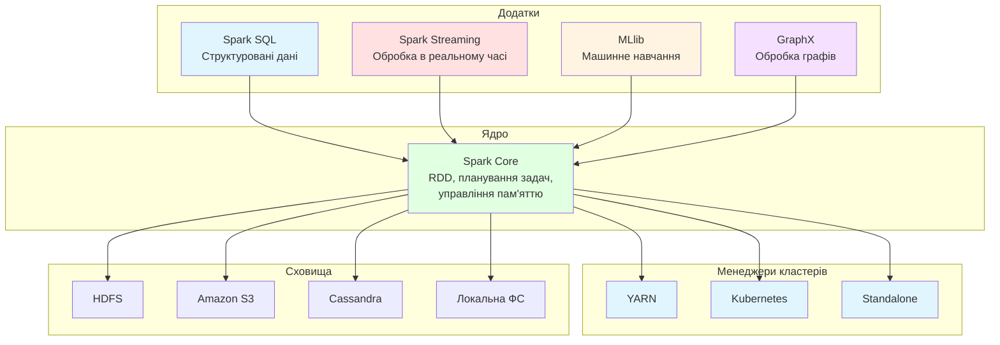
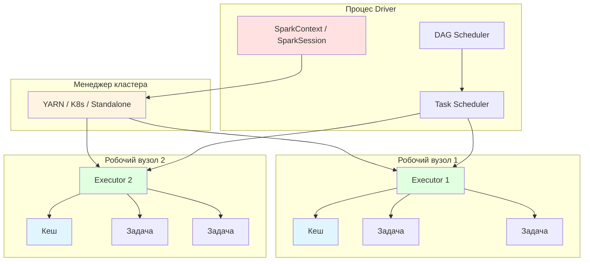
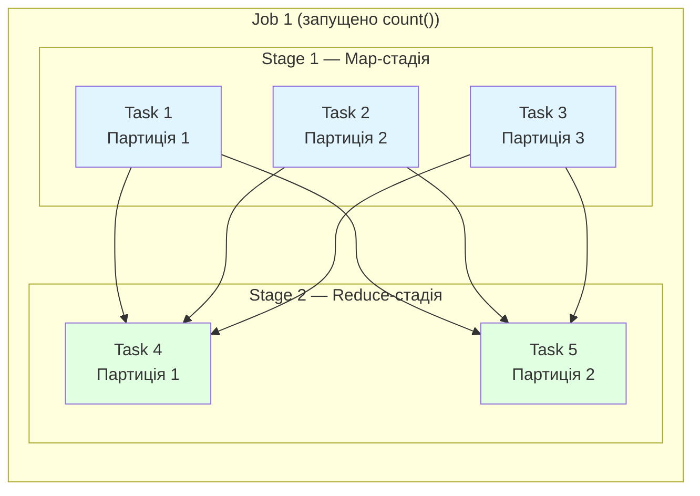
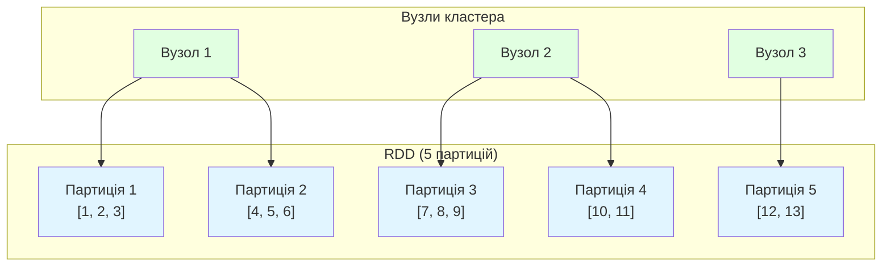
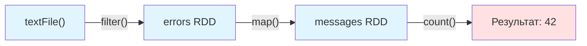
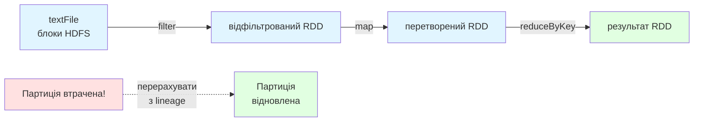
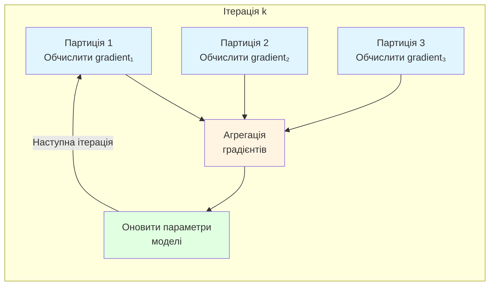

# Заняття 2-1. Apache Spark

> Подивитись [версію англійською](README.md)

**Дисципліна:** BIG DATA (Обробка надвеликих масивів даних)

**Змістовий модуль 2:** Apache Spark та машинне навчання на великих даних

**Тип:** Лекція

**Тривалість:** 90 хвилин (теорія ~50 хв + практика ~40 хв)

**Максимальна оцінка:** 2 бали (активна участь)

---

## Навчальні цілі

Після завершення заняття здобувачі повинні:

- пояснювати архітектуру Apache Spark та називати його основні компоненти;
- розрізняти SparkContext та SparkSession і знати, коли використовувати кожен;
- визначати RDD та класифікувати операції Spark на трансформації та дії;
- порівнювати Spark та MapReduce і пояснювати, чому Spark швидший для ітеративних навантажень;
- описувати проблему обчислювальної функції в розподілених системах;
- називати поширені алгоритми класифікації даних, застосовні до великих даних.

---

# ЧАСТИНА І — ТЕОРЕТИЧНА

---

## 1. Вступ до Apache Spark (10 хв)

### 1.1. Що таке Apache Spark?

Apache Spark — це **уніфікований аналітичний движок** для масштабної обробки даних. Спочатку розроблений у лабораторії AMPLab Каліфорнійського університету в Берклі у 2009 році, він був переданий Apache Software Foundation у 2013 році і з того часу став найбільш поширеним фреймворком для обробки великих даних.

**Ключова ідея:** на відміну від MapReduce, який записує проміжні результати на диск після кожного кроку, Spark зберігає дані **в оперативній пам'яті** між операціями. Це робить його до **100 разів швидшим** для ітеративних алгоритмів та інтерактивного аналізу даних.

### 1.2. Spark та Hadoop — позиціонування

Spark **не є заміною Hadoop** — це заміна MapReduce як обчислювального движка. Spark може працювати:

- **На YARN** — використовуючи менеджер ресурсів Hadoop (найпоширеніший варіант у виробництві)
- **На Kubernetes** — контейнеризоване розгортання
- **Standalone** — власний вбудований менеджер кластера Spark
- **На Mesos** — менеджер ресурсів Apache Mesos (застарілий)

Spark **продовжує використовувати HDFS** (або інші розподілені сховища) для постійного зберігання даних. Екосистема Hadoop (HDFS, YARN, Hive, HBase) залишається актуальною — Spark лише забезпечує швидший та гнучкіший рівень обробки.



### 1.3. Компоненти стеку Spark

| Компонент | Призначення | API |
|-----------|-------------|-----|
| **Spark Core** | Планування задач, управління пам'яттю, відновлення після збоїв, абстракція RDD | RDD API |
| **Spark SQL** | Обробка структурованих даних за допомогою SQL та DataFrames | DataFrame / Dataset API |
| **Spark Streaming** | Потокова обробка мікро-пакетами (також Structured Streaming для безперервної обробки) | DStream / Structured Streaming API |
| **MLlib** | Масштабоване машинне навчання (класифікація, регресія, кластеризація тощо) | Pipeline API |
| **GraphX** | Обчислення та аналітика на графах | Graph API |

---

## 2. Архітектура Spark (15 хв)

### 2.1. Driver та Executors

Кожний додаток Spark має однакову високорівневу структуру:



**Driver** — процес, який виконує `main()` та створює SparkContext/SparkSession:
- Перетворює код користувача в **DAG (спрямований ациклічний граф)** стадій та задач
- Домовляється про ресурси з менеджером кластера
- Розподіляє задачі між виконавцями та збирає результати
- Працює на клієнтській машині (client mode) або всередині кластера (cluster mode)

**Executor** — JVM-процес, запущений на робочих вузлах:
- Виконує задачі, призначені драйвером
- Зберігає дані в пам'яті або на диску для кешування
- Повідомляє про стан задач драйверу
- Кожен виконавець має фіксовану кількість ядер та фіксований обсяг пам'яті

**Менеджер кластера** — розподіляє ресурси:
- У режимі YARN ResourceManager призначає контейнери для драйвера та виконавців
- Spark ApplicationMaster працює всередині контейнера YARN та домовляється про контейнери для виконавців

### 2.2. SparkContext та SparkSession

**SparkContext** (Spark 1.x) — оригінальна точка входу до Spark:
- Підключається до менеджера кластера
- Створює RDD та broadcast-змінні
- Управляє акумуляторами
- Один SparkContext на JVM

**SparkSession** (Spark 2.0+) — **уніфікована точка входу**, яка об'єднує SparkContext, SQLContext та HiveContext:
- Надає доступ до DataFrames, Datasets та SQL
- Внутрішньо створює та обгортає SparkContext
- Рекомендований API для всіх нових додатків

```python
# Стиль Spark 1.x (тільки SparkContext)
from pyspark import SparkContext, SparkConf
conf = SparkConf().setAppName("MyApp").setMaster("local[*]")
sc = SparkContext(conf=conf)
rdd = sc.textFile("data.txt")

# Стиль Spark 2.0+ (SparkSession — рекомендований)
from pyspark.sql import SparkSession
spark = SparkSession.builder \
    .appName("MyApp") \
    .master("local[*]") \
    .getOrCreate()

# Доступ до SparkContext через SparkSession
sc = spark.sparkContext
rdd = sc.textFile("data.txt")

# Використання DataFrames (рекомендовано для структурованих даних)
df = spark.read.csv("data.csv", header=True, inferSchema=True)
```

| Характеристика | SparkContext | SparkSession |
|----------------|-------------|-------------|
| Введений | Spark 1.0 | Spark 2.0 |
| Рівень API | Низькорівневий (RDD) | Високорівневий (DataFrame, SQL) |
| Включає | Базову функціональність | Core + SQL + Hive + Streaming |
| Рекомендований | Лише для legacy-коду | Для всіх нових додатків |
| Декілька на JVM | Ні | Так (через `newSession()`) |

### 2.3. Модель виконання: Jobs, Stages, Tasks

При запуску операцій Spark виконання слідує такій ієрархії:

```
Application (Додаток)
  └── Job (Завдання — запускається дією, наприклад count(), collect())
        └── Stage (Стадія — обмежена операціями shuffle)
              └── Task (Задача — одна на партицію, виконується на executor)
```



**Ключовий висновок:** стадії розділяються **межами shuffle** (операціями, які вимагають обміну даними між партиціями, як-от `groupByKey`, `reduceByKey`, `join`). Всередині стадії задачі виконуються паралельно без обміну даними.

---

## 3. RDD — Resilient Distributed Datasets (15 хв)

### 3.1. Що таке RDD?

RDD (Resilient Distributed Dataset — стійкий розподілений набір даних) — це фундаментальна абстракція даних у Spark — **незмінна, розподілена колекція** об'єктів, яка може оброблятися паралельно.

**Ключові властивості:**
- **Resilient (стійкий)** — може бути відтворений з його лінії походження (послідовності трансформацій, що його створили) у разі втрати партиції
- **Distributed (розподілений)** — дані розділені на партиції між вузлами кластера
- **Dataset (набір даних)** — колекція записів (можуть бути будь-якими об'єктами Python/Java/Scala)



### 3.2. Створення RDD

```python
# Спосіб 1: Паралелізація локальної колекції
data = [1, 2, 3, 4, 5, 6, 7, 8, 9, 10]
rdd = sc.parallelize(data, numSlices=4)  # 4 партиції

# Спосіб 2: Завантаження із зовнішнього сховища
rdd = sc.textFile("hdfs:///data/logs.txt")
rdd = sc.textFile("s3a://bucket/data.csv")

# Спосіб 3: Трансформація існуючого RDD
rdd2 = rdd.map(lambda x: x * 2)
```

### 3.3. Трансформації та дії

Це найважливіша концепція в програмуванні на Spark. Всі операції з RDD поділяються на дві категорії:

**Трансформації** — визначають новий RDD з існуючого. Вони **ліниві** (lazy) — не виконуються до виклику дії:

| Трансформація | Опис | Приклад |
|--------------|------|---------|
| `map(f)` | Застосувати функцію f до кожного елемента | `rdd.map(lambda x: x * 2)` |
| `filter(f)` | Залишити елементи, для яких f повертає True | `rdd.filter(lambda x: x > 5)` |
| `flatMap(f)` | Як map, але f може повертати 0 або більше елементів | `rdd.flatMap(lambda x: x.split(" "))` |
| `reduceByKey(f)` | Об'єднати значення для кожного ключа за допомогою f | `rdd.reduceByKey(lambda a, b: a + b)` |
| `groupByKey()` | Згрупувати значення за ключем | `rdd.groupByKey()` |
| `sortByKey()` | Відсортувати за ключем | `rdd.sortByKey()` |
| `join(other)` | Inner join двох парних RDD за ключем | `rdd1.join(rdd2)` |
| `distinct()` | Видалити дублікати | `rdd.distinct()` |
| `union(other)` | Об'єднати два RDD | `rdd1.union(rdd2)` |

**Дії** — запускають обчислення та повертають результат драйверу або записують у сховище:

| Дія | Опис | Приклад |
|-----|------|---------|
| `collect()` | Повернути всі елементи драйверу | `rdd.collect()` |
| `count()` | Повернути кількість елементів | `rdd.count()` |
| `first()` | Повернути перший елемент | `rdd.first()` |
| `take(n)` | Повернути перші n елементів | `rdd.take(5)` |
| `reduce(f)` | Агрегувати всі елементи за допомогою f | `rdd.reduce(lambda a, b: a + b)` |
| `foreach(f)` | Застосувати f до кожного елемента (без повернення) | `rdd.foreach(print)` |
| `saveAsTextFile(path)` | Записати у файл | `rdd.saveAsTextFile("output/")` |
| `countByKey()` | Підрахувати елементи за ключем | `rdd.countByKey()` |

### 3.4. Ліниве обчислення та DAG

Spark використовує **ліниве обчислення** (lazy evaluation) — трансформації не виконуються негайно. Натомість Spark записує їх як граф лінії походження (DAG). Тільки при виклику дії Spark планує та виконує обчислення.

```python
# Нічого ще не відбувається — лише побудова DAG
lines = sc.textFile("access.log")                  # Трансформація
errors = lines.filter(lambda l: "ERROR" in l)       # Трансформація
error_messages = errors.map(lambda l: l.split("\t")[1])  # Трансформація

# ТЕПЕР Spark виконує весь ланцюг
count = error_messages.count()                      # Дія — запуск виконання!
```



**Навіщо ліниве обчислення?**
- Spark може **оптимізувати** весь ланцюг обчислень перед виконанням
- Непотрібні трансформації можуть бути пропущені
- Стадії можуть бути конвеєризовані (кілька трансформацій застосовуються за один прохід по даних)

### 3.5. Персистентність та кешування

За замовчуванням RDD перераховуються щоразу, коли до них застосовується дія. Для RDD, які використовуються повторно в кількох діях, можна **зберегти** їх у пам'яті:

```python
# Кешування в пам'яті (за замовчуванням)
errors.cache()  # еквівалент errors.persist(StorageLevel.MEMORY_ONLY)

# Перша дія — обчислює та кешує
print(errors.count())  # 42

# Друга дія — читає з кешу, без повторного обчислення
print(errors.first())  # "2024-01-15 ERROR Connection timeout"
```

| Рівень зберігання | Опис |
|-------------------|------|
| `MEMORY_ONLY` | Зберігати як десеріалізовані об'єкти в купі JVM. Партиції, що не вміщуються, відкидаються. |
| `MEMORY_AND_DISK` | Партиції, що не вміщуються в пам'ять, скидаються на диск. |
| `DISK_ONLY` | Зберігати всі партиції тільки на диску. |
| `MEMORY_ONLY_SER` | Зберігати як серіалізовані байти в пам'яті (більш компактно, але більше навантаження на CPU). |
| `MEMORY_AND_DISK_SER` | Серіалізація в пам'яті, скидання на диск. |

### 3.6. Лінія походження RDD та відмовостійкість

На відміну від Hadoop, який реплікує дані для забезпечення відмовостійкості, Spark використовує **лінію походження** (lineage). Кожен RDD пам'ятає трансформації, які використовувалися для його побудови. Якщо партиція втрачена (збій виконавця), Spark перераховує лише цю партицію з батьківського RDD:



Цей підхід є більш ефективним, ніж реплікація, для **обчислювально інтенсивних навантажень** — без додаткових витрат на зберігання та мережевий трафік для реплікації.

---

## 4. Spark проти MapReduce (5 хв)

### 4.1. Ключові відмінності

| Аспект | MapReduce | Spark |
|--------|-----------|-------|
| **Модель обробки** | На основі диска: read → map → write → read → reduce → write | В пам'яті: проміжні дані зберігаються в RAM |
| **Швидкість** | Повільніший — дискові операції між кожною стадією | До 100 разів швидший для ітеративних алгоритмів |
| **Зручність використання** | Багатослівний Java-код (класи mapper + reducer) | Лаконічний API на Python, Scala, Java, R |
| **Ітеративна обробка** | Погана — кожна ітерація читає з / записує на диск | Відмінна — кешовані RDD уникають повторних дискових операцій |
| **Обробка в реальному часі** | Тільки пакетна | Пакетна + мікро-пакетна потокова + Structured Streaming |
| **DAG-виконання** | Фіксована 2-фазна модель (map → reduce) | Довільний DAG стадій |
| **Відмовостійкість** | Реплікація даних (HDFS) | Лінія походження RDD (перерахунок) |
| **Кешування** | Вбудоване кешування відсутнє | Кешування проміжних результатів в пам'яті |
| **Мови** | Java (основна) | Python, Scala, Java, R, SQL |

### 4.2. Коли використовувати кожен

**MapReduce все ще доцільний, коли:**
- Обробка дуже великих наборів даних за один прохід (ітерації не потрібні)
- Пам'яті обмаль і дані не вміщуються в RAM
- Стабільність важливіша за швидкість (MapReduce надзвичайно зрілий)
- Кластер вже працює з Hadoop без Spark

**Spark є кращим вибором, коли:**
- Ітеративні алгоритми (машинне навчання, обробка графів)
- Інтерактивне дослідження та аналіз даних
- Потреба в потоковій обробці
- Складні багатоетапні конвеєри обробки даних (ETL)
- SQL-запити на великих наборах даних (через Spark SQL)

### 4.3. Ітеративна обробка: ключова перевага

Різниця в продуктивності найбільш суттєва для ітеративних алгоритмів (наприклад, машинне навчання, PageRank):

```mermaid
graph TB
    subgraph "MapReduce — ітеративна обробка"
        MR1["Ітерація 1<br/>Read → Map → Reduce → Write в HDFS"]
        MR2["Ітерація 2<br/>Read → Map → Reduce → Write в HDFS"]
        MR3["Ітерація N<br/>Read → Map → Reduce → Write в HDFS"]
        MR1 -->|"дисковий I/O"| MR2
        MR2 -->|"дисковий I/O"| MR3
    end

    subgraph "Spark — ітеративна обробка"
        S0["Завантаження даних → Кешування в пам'яті"]
        S1["Ітерація 1 (в пам'яті)"]
        S2["Ітерація 2 (в пам'яті)"]
        S3["Ітерація N (в пам'яті)"]
        S0 --> S1
        S1 -->|"без дискового I/O"| S2
        S2 -->|"без дискового I/O"| S3
    end

    style MR1 fill:#ffe1e1
    style MR2 fill:#ffe1e1
    style MR3 fill:#ffe1e1
    style S0 fill:#e1ffe1
    style S1 fill:#e1ffe1
    style S2 fill:#e1ffe1
    style S3 fill:#e1ffe1
```



---

## 5. Проблема обчислювальної функції (5 хв)

### 5.1. Постановка проблеми

**Проблема обчислювальної функції** в розподілених обчисленнях стосується складності ефективного обчислення функції `f(D)` над набором даних `D`, розподіленим між кількома вузлами.

Основні виклики:

1. **Локальність даних** — переміщення даних через мережу є дорогим. Ідеал — переміщувати обчислення до даних, а не дані до обчислень.

2. **Часткова агрегація** — не кожна функція може бути обчислена незалежно на партиціях з подальшим об'єднанням. Наприклад:
   - `sum(D)` — **декомпозиційна**: обчислити часткові суми на кожному вузлі, потім підсумувати часткові результати
   - `mean(D)` — **частково декомпозиційна**: потребує як суми, так і кількості з кожної партиції
   - `median(D)` — **не декомпозиційна**: потребує доступу до повного відсортованого набору даних

3. **Накладні витрати на комунікацію** — фаза shuffle (обмін даними між вузлами) є найдорожчою операцією в розподіленій обробці. Мінімізація shuffle — ключ до продуктивності.

### 5.2. Як Spark вирішує цю проблему

Spark пом'якшує проблему обчислювальної функції за допомогою кількох механізмів:

- **Ліниве обчислення + оптимізація DAG** — Spark аналізує весь граф обчислень перед виконанням, мінімізуючи непотрібні shuffle
- **Вузькі та широкі залежності** — вузькі залежності (map, filter) не потребують shuffle; широкі залежності (groupByKey, join) потребують. Spark об'єднує вузькі залежності в єдині стадії
- **Партиціонування** — користувачі можуть контролювати розподіл даних для розміщення пов'язаних даних на одному вузлі, зменшуючи shuffle при join
- **Broadcast-змінні** — малі набори даних можуть бути надіслані на всі вузли одноразово, уникаючи повторних мережевих передач
- **Акумулятори** — забезпечують ефективні розподілені лічильники та суми без shuffle

---

## 6. Класифікація даних та алгоритми для великих даних (5 хв)

### 6.1. Класифікація даних у контексті великих даних

**Класифікація** — це задача навчання з учителем (supervised learning) — маючи розмічені навчальні дані, побудувати модель, що передбачає мітку класу для нових, невідомих даних.

У контексті великих даних класифікація має унікальні виклики:
- Навчальні дані можуть бути **занадто великими** для пам'яті однієї машини
- Навчання моделі може потребувати **багатьох проходів** (ітерацій) по даних
- Простір ознак може бути **надзвичайно високорозмірним**
- Дані можуть бути **розподілені** по кластеру, що потребує спеціалізованих розподілених алгоритмів

### 6.2. Алгоритми класифікації для великих даних

Наступні алгоритми реалізовані в Spark MLlib та призначені для розподіленого виконання:

| Алгоритм | Тип | Як масштабується | Випадок використання |
|----------|-----|-------------------|---------------------|
| **Логістична регресія** | Лінійний класифікатор | Розподілений градієнтний спуск, паралелізм за даними | Бінарна/багатокласова класифікація, інтерпретовані моделі |
| **Дерево рішень** | На основі дерев | Порівневе навчання, розподілена агрегація гістограм | Нелінійні залежності, важливість ознак |
| **Випадковий ліс** | Ансамбль дерев | Кожне дерево навчається на вибірці даних, дерева паралельно | Висока точність, зменшення перенавчання |
| **Градієнтний бустинг (GBT)** | Ансамбль, послідовний | Кожне дерево виправляє помилки попередніх | Найкраща точність для табличних даних |
| **Наївний Баєс** | Імовірнісний | Однопрохідна агрегація підрахунків | Класифікація тексту, дуже швидке навчання |
| **SVM (лінійний)** | Лінійний класифікатор | Розподілена оптимізація | Високорозмірні розріджені дані |

### 6.3. Як MLlib розподіляє навчання

Spark MLlib використовує підхід **паралелізму за даними** для масштабування машинного навчання:

1. **Дані партиціонуються** між вузлами кластера
2. Кожен виконавець обчислює **локальні градієнти** на своїй партиції
3. Градієнти **агрегуються** (зводяться) на всіх вузлах
4. Параметри моделі **оновлюються** за допомогою агрегованого градієнта
5. Кроки 2–4 **ітеруються** до збіжності

Саме тут кешування в пам'яті Spark дає найбільшу перевагу — навчальні дані залишаються кешованими в пам'яті між ітераціями, тоді як MapReduce перечитував би їх з диска кожного разу.



### 6.4. Зв'язок з наступними практичними заняттями

На заняттях 2-2 та 2-3 ви працюватимете зі Spark на практиці:

- **Заняття 2-2** — налаштування Apache Spark, робота з RDD та DataFrames, Spark Structured Streaming з Kafka для аналітики кібербезпеки в реальному часі
- **Заняття 2-3** — навчання моделей машинного навчання засобами MLlib (класифікація, регресія, кластеризація)

Практичні матеріали доступні в репозиторії spark-tutorial, який надає повне контейнеризоване середовище з Kafka, PostgreSQL та Spark для аналізу подій кібербезпеки.

---

# ЧАСТИНА ІІ — ПРАКТИЧНА

---

## Вправа 1: Інтерактивна сесія PySpark (15 хв)

**Мета:** запустити оболонку PySpark та поекспериментувати з трансформаціями та діями RDD.

### Передумови

- Встановлено Python 3.10+
- Встановлено PySpark: `pip install pyspark`

### Крок 1. Запуск оболонки PySpark

```bash
# Запуск інтерактивної оболонки PySpark
pyspark
```

Ви побачите банер Spark та запрошення `>>>`. SparkSession з іменем `spark` та SparkContext з іменем `sc` створюються автоматично.

### Крок 2. Створення та трансформація RDD

```python
# Створити RDD зі списку
numbers = sc.parallelize([1, 2, 3, 4, 5, 6, 7, 8, 9, 10], 4)

# Перевірити кількість партицій
print(f"Партиції: {numbers.getNumPartitions()}")  # 4

# Трансформація: помножити кожен елемент на 2
doubled = numbers.map(lambda x: x * 2)

# Нічого ще не обчислено! Запустимо дію:
print(doubled.collect())  # [2, 4, 6, 8, 10, 12, 14, 16, 18, 20]

# Фільтрація парних чисел з оригінального RDD
evens = numbers.filter(lambda x: x % 2 == 0)
print(evens.collect())  # [2, 4, 6, 8, 10]

# Reduce: підсумувати всі елементи
total = numbers.reduce(lambda a, b: a + b)
print(f"Сума: {total}")  # 55

# Підрахунок
print(f"Кількість: {numbers.count()}")  # 10
```

### Крок 3. Підрахунок слів (Word Count) з RDD

```python
# Класичний підрахунок слів — порівняйте з MapReduce!
text = sc.parallelize([
    "spark is fast and powerful",
    "spark supports python and scala",
    "big data processing with spark",
    "hadoop mapreduce is slower than spark"
])

# Крок 1: Розбити рядки на слова (flatMap)
words = text.flatMap(lambda line: line.split(" "))

# Крок 2: Створити пари (слово, 1) (map)
pairs = words.map(lambda word: (word, 1))

# Крок 3: Підсумувати кількість за ключем (reduceByKey)
counts = pairs.reduceByKey(lambda a, b: a + b)

# Крок 4: Відсортувати за кількістю у спадному порядку
sorted_counts = counts.sortBy(lambda x: -x[1])

# Дія: зібрати та вивести результати
for word, count in sorted_counts.collect():
    print(f"{word}: {count}")
```

Очікуваний вивід:
```
spark: 4
and: 2
is: 2
fast: 1
powerful: 1
supports: 1
python: 1
scala: 1
big: 1
data: 1
processing: 1
with: 1
hadoop: 1
mapreduce: 1
slower: 1
than: 1
```

**Обговорення:** порівняйте це з Hadoop MapReduce Word Count із заняття 1-4. Зверніть увагу, як весь конвеєр виражається в 4 рядках коду, на відміну від написання окремих класів Mapper та Reducer. Логіка ідентична — `flatMap` відповідає Mapper, `reduceByKey` відповідає Reducer — але код значно лаконічніший.

---

## Вправа 2: DataFrames та Spark SQL (15 хв)

**Мета:** робота зі структурованими даними за допомогою DataFrame API та SQL-запитів Spark.

### Крок 1. Створення DataFrame

```python
from pyspark.sql import SparkSession
from pyspark.sql.functions import col, avg, count, desc

# SparkSession вже створено в оболонці pyspark як 'spark'

# Створити DataFrame зі списку кортежів
data = [
    ("Alice", "Engineering", 85000),
    ("Bob", "Engineering", 92000),
    ("Charlie", "Marketing", 68000),
    ("Diana", "Marketing", 72000),
    ("Eve", "Engineering", 98000),
    ("Frank", "Sales", 61000),
    ("Grace", "Sales", 65000),
    ("Hank", "Engineering", 88000),
]

columns = ["name", "department", "salary"]
df = spark.createDataFrame(data, columns)

# Показати DataFrame
df.show()
# +-------+-----------+------+
# |   name| department|salary|
# +-------+-----------+------+
# |  Alice|Engineering| 85000|
# |    Bob|Engineering| 92000|
# |Charlie|  Marketing| 68000|
# ...
```

### Крок 2. Операції з DataFrame

```python
# Фільтр: працівники із зарплатою > 80000
high_earners = df.filter(col("salary") > 80000)
high_earners.show()

# Групування за відділом: середня зарплата та кількість
dept_stats = df.groupBy("department") \
    .agg(
        avg("salary").alias("avg_salary"),
        count("*").alias("employee_count")
    ) \
    .orderBy(desc("avg_salary"))

dept_stats.show()
# +-----------+----------+--------------+
# | department|avg_salary|employee_count|
# +-----------+----------+--------------+
# |Engineering|   90750.0|             4|
# |  Marketing|   70000.0|             2|
# |      Sales|   63000.0|             2|
# +-----------+----------+--------------+
```

### Крок 3. Spark SQL

```python
# Зареєструвати DataFrame як тимчасове SQL-подання
df.createOrReplaceTempView("employees")

# Виконати SQL-запити напряму
result = spark.sql("""
    SELECT department,
           AVG(salary) AS avg_salary,
           MAX(salary) AS max_salary,
           MIN(salary) AS min_salary
    FROM employees
    GROUP BY department
    ORDER BY avg_salary DESC
""")
result.show()

# Знайти працівників із зарплатою вище середньої по відділу
above_avg = spark.sql("""
    SELECT e.name, e.department, e.salary, d.avg_salary
    FROM employees e
    JOIN (
        SELECT department, AVG(salary) AS avg_salary
        FROM employees
        GROUP BY department
    ) d ON e.department = d.department
    WHERE e.salary > d.avg_salary
""")
above_avg.show()
```

---

## Вправа 3: Порівняння планів виконання (10 хв)

**Мета:** зрозуміти, як Spark оптимізує виконання за допомогою оптимізатора Catalyst.

```python
# Метод explain() показує план виконання
df.filter(col("salary") > 80000) \
  .groupBy("department") \
  .count() \
  .explain(True)
```

Це виводить план виконання з чотирма фазами:
1. **Parsed Logical Plan** — що написав користувач
2. **Analyzed Logical Plan** — з розв'язаними іменами стовпців та типами
3. **Optimized Logical Plan** — після оптимізацій Catalyst (predicate pushdown тощо)
4. **Physical Plan** — фактичний план виконання з конкретними операторами

**Теми для обговорення:**
- Зверніть увагу, як фільтр застосовується **до** groupBy (predicate pushdown)
- DataFrames оптимізуються Catalyst; RDD — ні — користувач сам відповідає за оптимізацію
- Це ключова причина віддавати перевагу DataFrames над RDD для структурованих даних

---

## Самостійна робота

**Тема:** Особливості технології Apache Spark, порівняння Spark та MapReduce, алгоритми класифікації даних.

### Завдання:

1. **Письмові відповіді** (2–3 сторінки):
   - Опишіть проблему обчислювальної функції. Чому `median()` складніше обчислити в розподіленій системі, ніж `sum()`?
   - Класифікуйте типи даних (структуровані, напівструктуровані, неструктуровані) та наведіть 2 приклади кожного
   - Порівняйте щонайменше 3 алгоритми класифікації, придатні для великих даних (з таблиці лекції). Для кожного поясніть, коли він є найкращим вибором
   - Перелічіть основні відмінності між Spark та MapReduce. Чому Spark швидший для ітеративних алгоритмів?

2. **Практичне** (за бажанням, +1 бал):
   - Встановіть PySpark локально та запустіть приклад Word Count з Вправи 1
   - Надайте скріншот оболонки PySpark з результатом

### Критерії оцінювання:

| Компонент | Бали |
|-----------|------|
| Активна участь у лекції та вправах | 1 |
| Якість письмових відповідей | 1 |
| **Разом** | **2** |

---

## Рекомендовані ресурси

- [Заняття 1-4 — Екосистема Apache Hadoop](../lesson1-4/README.md)
- [Заняття 1-5 — Налаштування та робота з Apache Hadoop](../lesson1-5/README.md)
- Документація Apache Spark: https://spark.apache.org/docs/latest/
- Довідник PySpark API: https://spark.apache.org/docs/latest/api/python/
- Керівництво з програмування RDD: https://spark.apache.org/docs/latest/rdd-programming-guide.html
- Керівництво Spark SQL: https://spark.apache.org/docs/latest/sql-programming-guide.html
- Керівництво MLlib: https://spark.apache.org/docs/latest/ml-guide.html
- Chambers B., Zaharia M. — *Spark: The Definitive Guide* (O'Reilly, 2018)
- Damji J.S. et al. — *Learning Spark*, 2-ге видання (O'Reilly, 2020)
